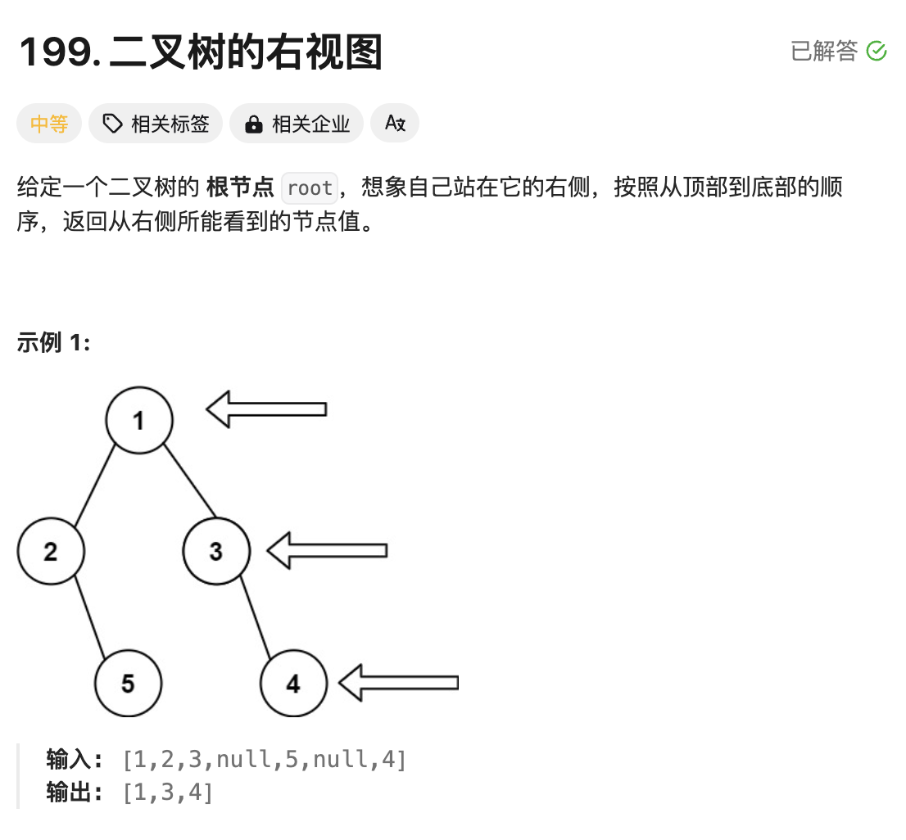

# 题目



# 思路

二叉树为分层结构，要想看到每一层的最右边的节点值，按照层序遍历的思想，记录每一层的最后一个节点值即可。

层序遍历也可叫广度优先遍历，二叉树层序遍历代码套路如下：

```go
// 记录节点
nodes := []*TreeNode{}
nodes = append(nodes,root)
for len(nodes) != 0 {
  // 本层要遍历的节点个数
  count := len(nodes)
  for i := 0;i<count;i++ {
    
    // 遍历本层节点的同时，将下一层的【左节点】保存到nodes中
    if nodes[i].Left != nil {
      nodes = append(nodes,nodes[i].Left)
    }
     // 遍历本层节点的同时，将下一层的【右节点】保存到nodes中
    if nodes[i].Right != nil {
      nodes = append(nodes,nodes[i].Right)
    }
  }
  // 上面for循环完成本层节点遍历后，将本层节点剔除，剩下的就是下一层要遍历的节点
  nodes = [count:]
  
}
```

# 完整代码

```go
/**
 * Definition for a binary tree node.
 * type TreeNode struct {
 *     Val int
 *     Left *TreeNode
 *     Right *TreeNode
 * }
 */
func rightSideView(root *TreeNode) []int {
    //层序遍历
    result := []int{}
    if root == nil {
        return result
    }
    nodes := []*TreeNode{}
    nodes = append(nodes,root)

    for len(nodes) != 0 {
        count := len(nodes)

        for i := 0;i<count;i++ {
          	//nodes中最后一个节点，就是右视图，需要的节点值
            if i == count-1 { 
                result = append(result,nodes[i].Val)
            }

            if nodes[i].Left != nil {
                nodes = append(nodes,nodes[i].Left)
            }
            if nodes[i].Right != nil {
                nodes = append(nodes,nodes[i].Right)
            }
        }
        //!!!弹出nodes中的被遍历过的节点
        nodes = nodes[count:]
    }
    return result
}
```

