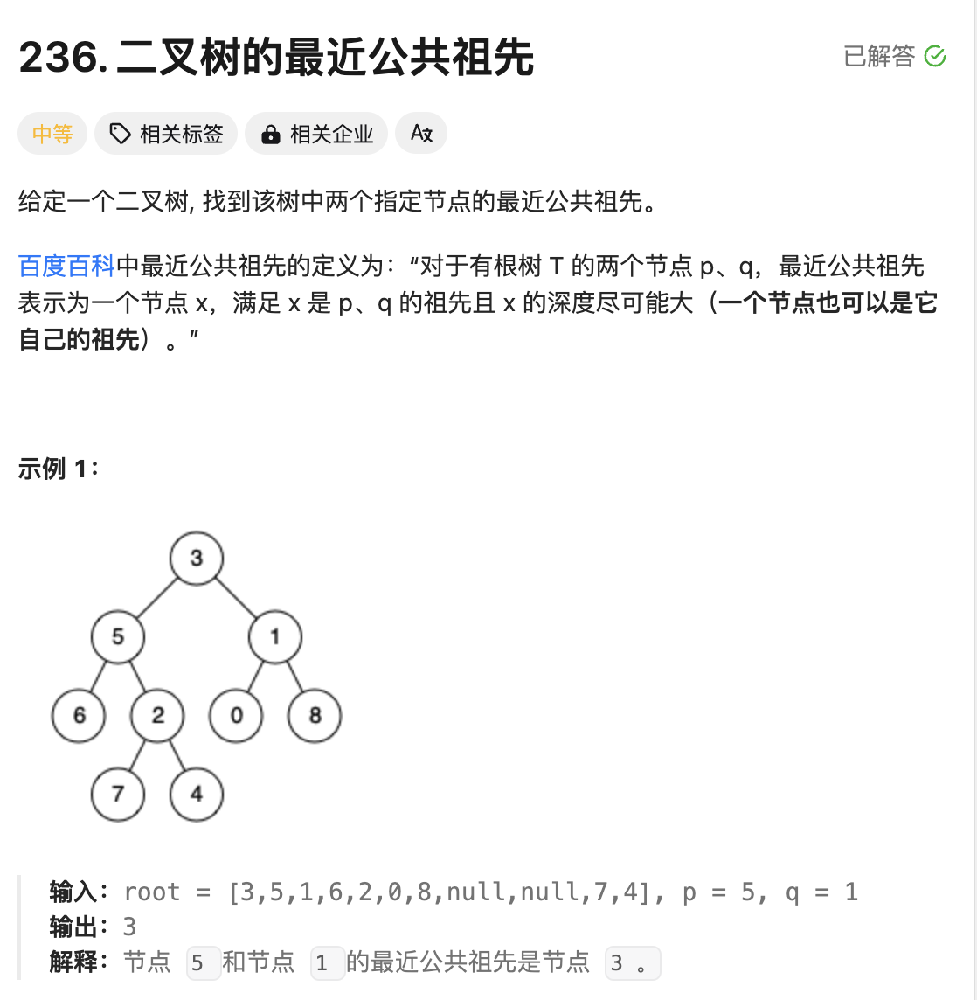
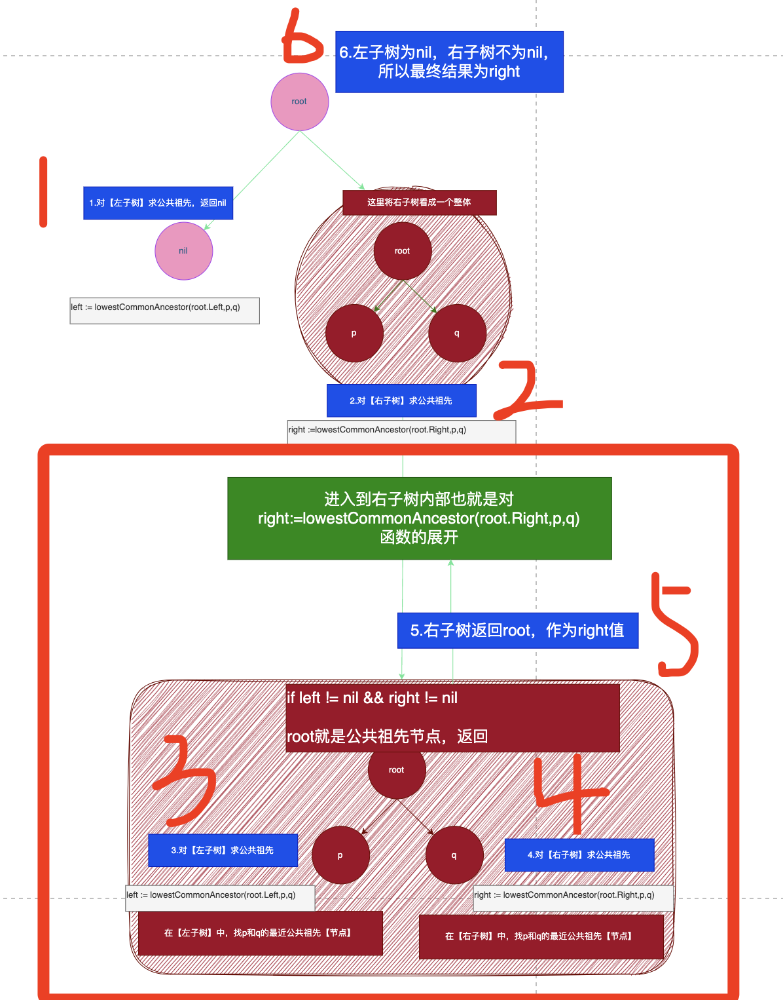

# 题目



# 思路

二叉树递归套路

- 前序遍历

```go
func preOrder(root *TreeNode) {
  // 前序位置：表示在进入左子树和右子树【之前】，do something...
  preOrder(root.Left)
  preOrder(root.Right)
}
```

- 中序遍历

```go
func preOrder(root *TreeNode) {
  preOrder(root.Left)
  // 中序位置：表示在进入左子树【之后】 和进入右子树【之前】，do something...
  preOrder(root.Right)
}
```

- 后序遍历

```go
func preOrder(root *TreeNode) {
  preOrder(root.Left)
  preOrder(root.Right)
  // 后序位置：表示进入左右子树【之后】，do something...
}
```

【非常重要】：**明确递归函数的定义**

明确递归函数完成了什么，不要将思维陷入到递归逻辑中，只需要考虑当前需要干什么。比如上面的各个遍历位置，递归函数完成【前】【后】，当前的位置需要做什么逻辑处理。


这里 `lowestCommonAncestor 函数定义为：在root树中，找到p和q的最近公共祖先【节点】`。在递归进入左右子树之前，我们先看下当前节点`root`值是否和`p q`相同。

如果不相同

调用`lowestCommonAncestor`函数前，将左子树整体【当作一个节点】，右子树也整体【当作一个节点】；

调用`lowestCommonAncestor`函数后，表示对左子树这个整体进行了一次查找，对右子树这个整理进行了一次查找；

查找后的结果，left表示左子树整体的结果，right表示右子树整体的结果。

所在在看代码的时候，

`left := lowestCommonAncestor(root.Left,p,q)`这种`lowestCommonAncestor`函数调用的地方要有整体的思维；如下图的1/2/6就是整体思维；

`lowestCommonAncestor`的内部的逻辑处理，表示对具体的`root`节点进行处理，这个时候思维转化为具体的一个节点。如下图的3/4/5就是进入的具体的函数中的具体逻辑；



# 完整代码

```go
/**
 * Definition for a binary tree node.
 * type TreeNode struct {
 *     Val int
 *     Left *TreeNode
 *     Right *TreeNode
 * }
 */

// lowestCommonAncestor 表示在root树中，找到p和q的最近公共祖先【节点】
 func lowestCommonAncestor(root, p, q *TreeNode) *TreeNode {
   	//在进入递归之前，判断p和q是否和root相同
     if root == p || root == q || root == nil{
         return root
     }
   	// 表示在【左子树】中，找p和q的最近公共祖先【节点】
     left := lowestCommonAncestor(root.Left,p,q)
   	// 表示在【右子树】中，找p和q的最近公共祖先【节点】
     right := lowestCommonAncestor(root.Right,p,q)
   	//.... 在进入递归之后...
   	// 如果左右都不为nil，【下图】中的3/4/5的流程
     if left != nil && right != nil {
         return root
     }
   	// 如果右为空，左不为空
     if left != nil {
         return left
     }
   	// 如果左为空，右不为空，【下图】1/2/6的流程
     if right != nil {
         return right
     }
     return nil
}
```

代码解释：

