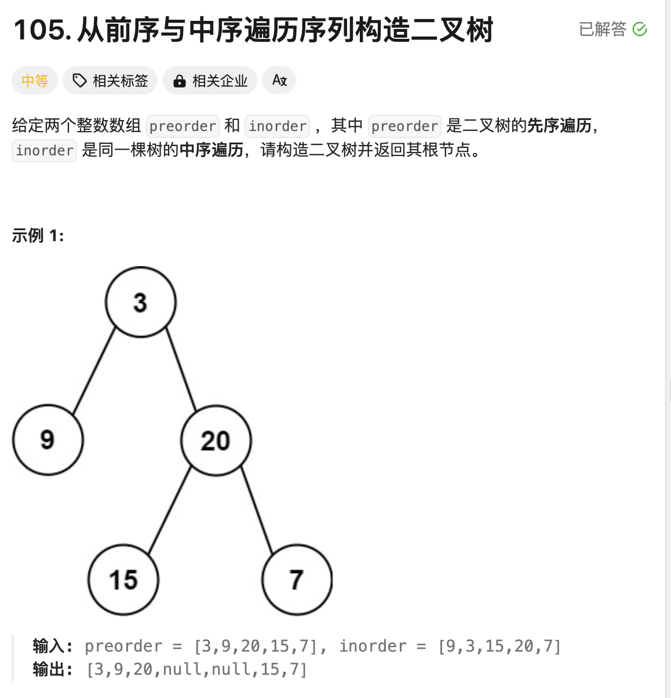
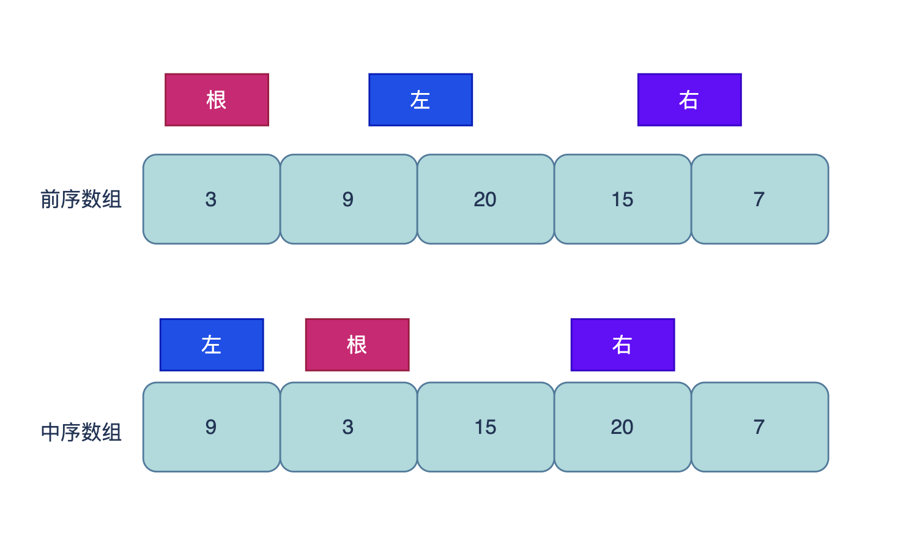
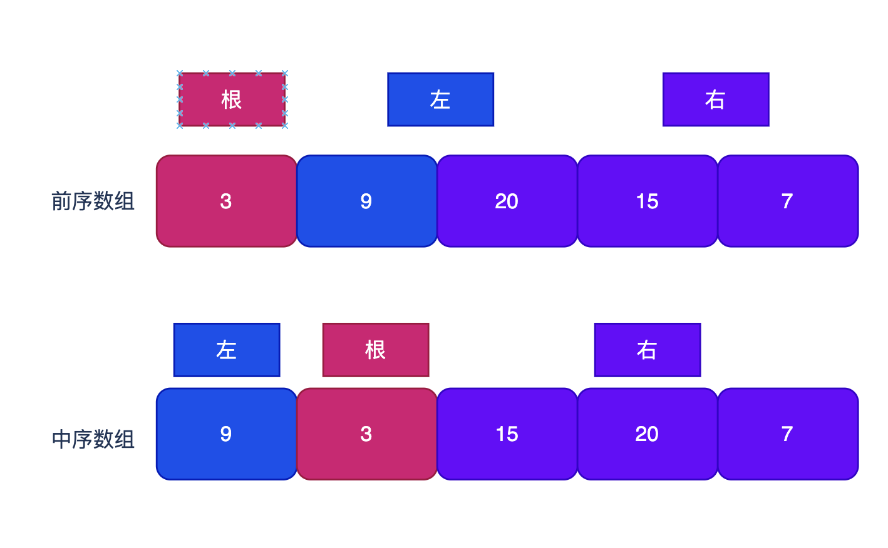
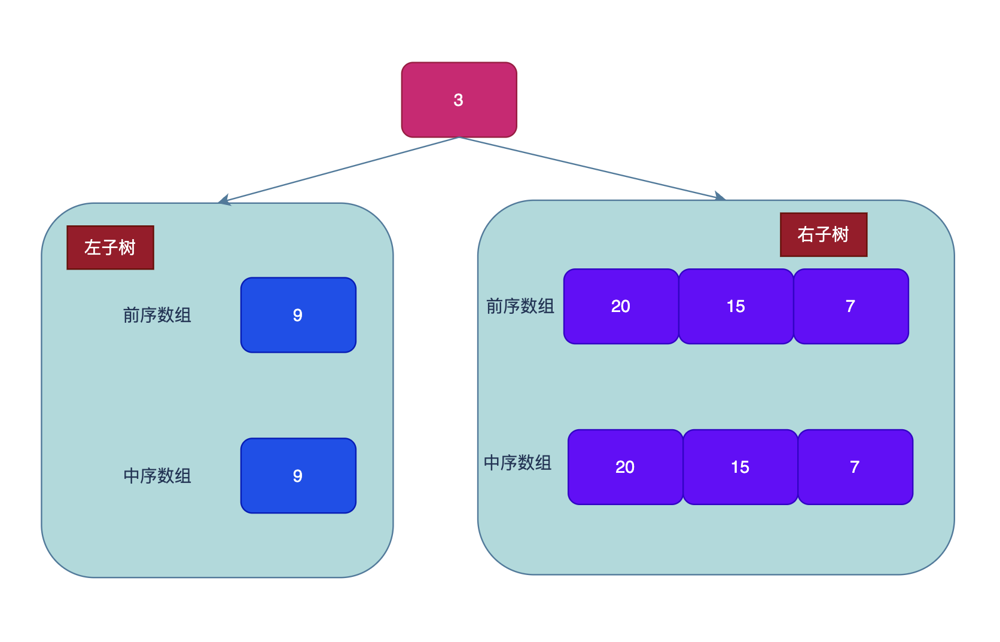

# 题目



# 思路

二叉树

前序遍历的结果为：【根】【左】【右】

中序遍历的结果为：【左】【根】【右】



从前序遍历可知，前序数组中第一个元素`3`肯定是【根】，具体的【左右】是什么不清楚；

再看中序数组中，【根】元素`3`恰好把【左右】切分成两个部分，【左】边一个元素`9`，【右】边3个元素 `15 20 7`。依次规则，前序数组中也可以知道了哪些属于【左】哪些属于【右】



就可以将数组切分成3段，分别代表【根】【左】【右】的范围。再利用分治的思想，继续分别以切分出来的【左】子数组和【右】子数组，作为前序数组和中序数组，构建左子树和右子树。



# 完整代码

```go
/**
 * Definition for a binary tree node.
 * type TreeNode struct {
 *     Val int
 *     Left *TreeNode
 *     Right *TreeNode
 * }
 */
func buildTree(preorder []int, inorder []int) *TreeNode {
    if len(preorder) == 0 || len(inorder) == 0 {
        return nil
    }
    leftLen := 0
    //前序的第一个元素为根节点
    va := preorder[0]
    //在中序遍历中找到对应的位置
    for k,v := range inorder {
        if v == va {
            leftLen = k
            break 
        }
    }
  	// 构建二叉树
    root := &TreeNode{Val:preorder[0],Left:buildTree(preorder[1:1+leftLen],inorder[:leftLen]),Right:buildTree(preorder[1+leftLen:],inorder[leftLen+1:])}
    return root
}
```


