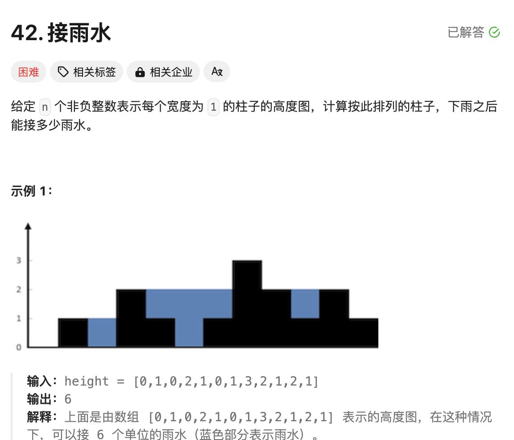
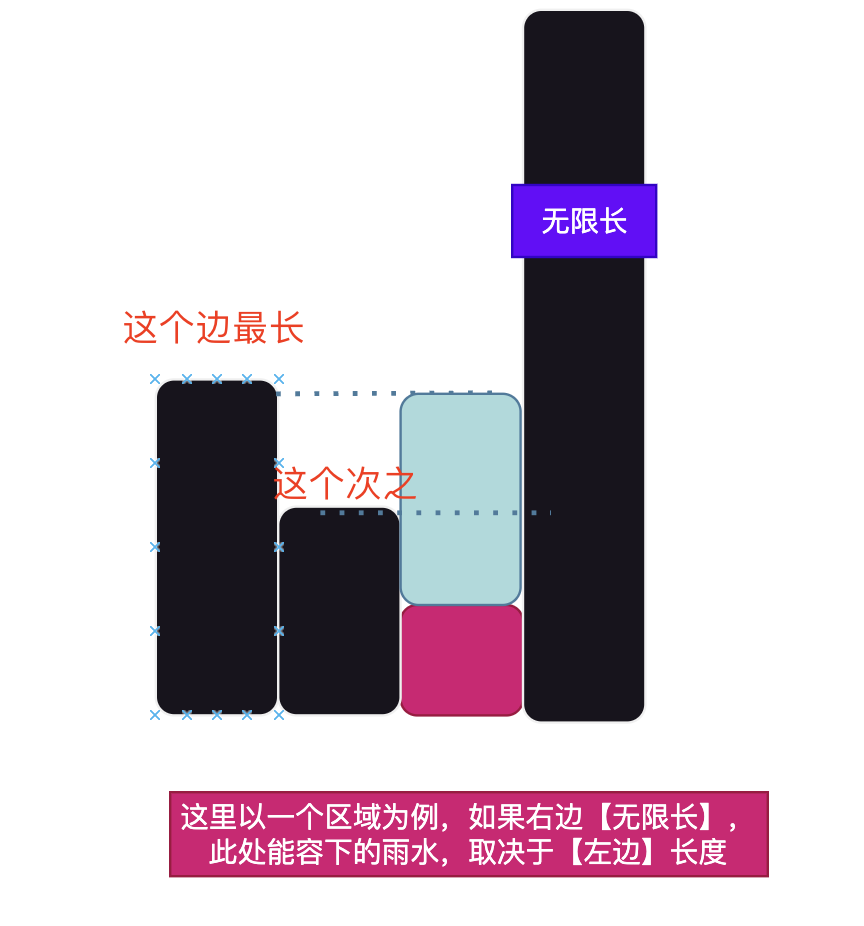
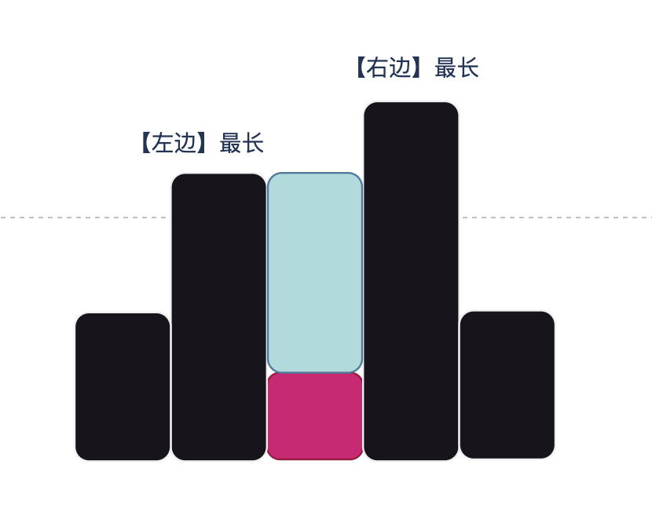

# 题目



# 思路

题目要求蓝色区域的大小，我们先求一个柱子的雨水容量



由图观察可知，雨水的容量取决于【左边】的最长的边

同理，如果我们让【左边】无限长，雨水的容量就取决于【右边】的最长边（如图）：


由此可知：【左边】的最长边和【右边】的最长边，决定了雨水容量的大小。



再观察此图可知，【左右】都找到了最长边，但是雨水的容量，又取决于**【左边最长】和【右边最长】的【最小长度】**

由此得到的结论如下：

```go
1.获取当前位置的【左边最大值】 和【右边最大值】
2.再取【左边最大值】 和【右边最大值】的【最小值】，决定了当前的容量
```

# 完整代码

```go
func trap(height []int) int {
    ///！！！答案理解起来比较容易
    ///找当前位置i，左右最高的高度是多少
    //从左到右遍历[0...i]，求左边到当前位置i的最高高度，l_dp[i] = max(height[i],l_dp[i-1]) 
    //从右到左遍历[i...end ]，求右边到当前位置i的最高高度，r_dp[i] = max(height[i],r_dp[i+1])

  	// 定义l_dp[i] 表示从[0..i] 柱子的最高高度
    l_dp := make([]int,len(height)) 
    l_dp[0] = height[0]
    for i := 1;i < len(height);i++ {
        l_dp[i] = max(height[i],l_dp[i-1]) // l_dp[i-1]前一个柱子的高度
    }
 	 //定义 r_dp[i]表示从公 [i...end] 柱子的最高高度
    r_dp := make([]int,len(height)) 
    r_dp[len(height)-1] = height[len(height)-1]

    for i := len(height)-2;i >= 0;i-- {
        r_dp[i] = max(height[i],r_dp[i+1])
    }

    //当前柱子能搞保存到水量
    result := 0
    for i := 0;i < len(height);i++ {
        result += min(l_dp[i],r_dp[i]) - height[i] //左边的最高高度 和 右边的最高高度，取最小值，减去当前的高度，表示当前位置可以保存到水量
    }
    return result
}

func min( a,b int) int{
    if a < b {
        return a
    }
    return b
}

func max( a,b int) int{
    if a > b {
        return a
    }
    return b
}
```


