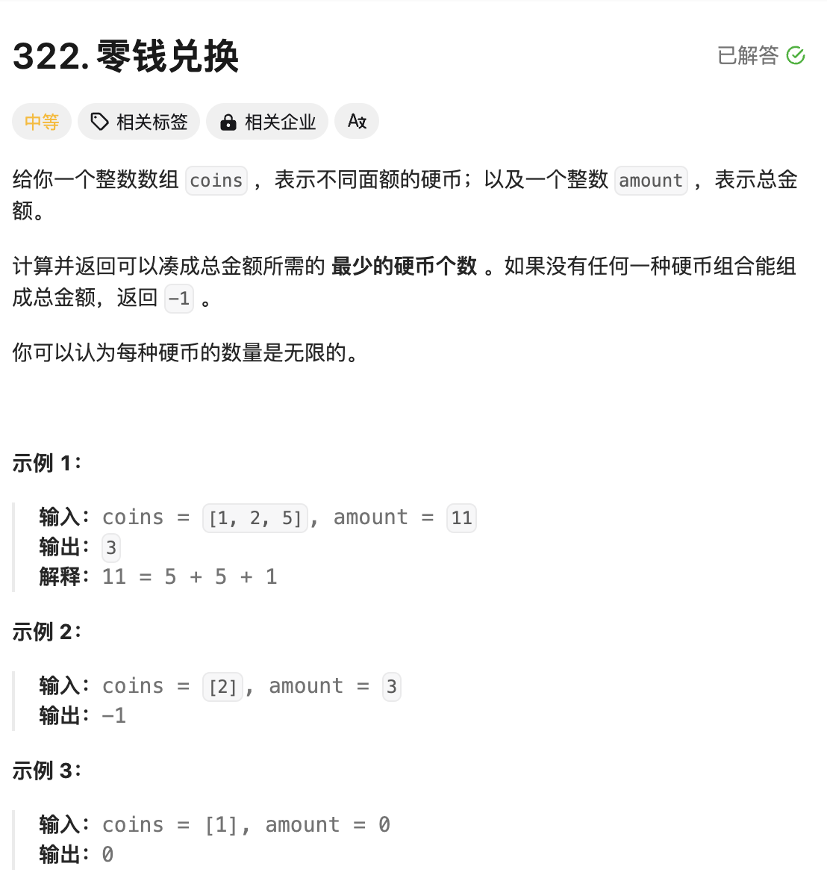

# 题目

这是很经典的一道题目，如果题目不好理解，可以先看下这个类比：

可以想象成一个有固定容量的麻袋，现在地上有很多的包裹；

- 有些包裹可能很大，完全超过麻袋的容量，肯定是塞不进去的；
- 有些包裹可以一次正好装满麻袋；
- 有些包裹很小，每次只能把麻袋充实一点，只要塞的足够也可以正好装满麻袋；
- 还有些包裹比如只有大小为3的包裹，始终是无法塞满容量为4的麻袋；因为塞进去了3，容量剩余为4-3=1，剩下的1肯定是放不了3的；



# 思路

一般看到题目要求最值问题，就想到动态规划的思路

```tex
动态规划题目套路：
1. 明确题目含义，定义dp数组（dp数组定义：一般套路就是看题目的最后一句话，比如求什么最大值或者最小值，那dp数组就定义为某某结果的最大值或最小值）
2. 找dp[i] 和 dp[i-1]之间的递推关系
3. base case的初始化
4. 返回结果
```

- 定义dp数组：`dp[i]`表示凑成总金额`i`所需的最少硬币个数为`dp[i]`

- 找递推关系：当我们每次从`coins`中选择1枚硬币（金额）`coins[j]`，来凑成总金额`i`，那剩余的总金额即为：`i - coins[j]`，

  按照`dp`数组定义凑成`i - coins[j]`总金额所需的最少硬币个数为`dp[i-coins[j]]`，所以凑成`dp[i]`的最少硬币个数为`dp[i] = dp[i-coins[j]] + 1`，这里的1就是指代的`coins[j]`这枚硬币。

  但是我们知道除了可以选择`coins[j]`，还可以选择`coins[j+1] coins[j+2]`等等

  那我们只需要求出最小的那个即可,所以最终的状态转移函数为`dp[i] = min( dp[i] , dp[i-coins[0....]]+ 1) `（`coins[0....]`表示可以选择的硬币有多个`)

- 那每个`dp[i]`的初始值是什么？假如全部用1元硬币来凑数，那需要的硬币个数肯定是最多的。因为只需要一个比较大的初始值，所以统一用`amount + 1`来表示一个极大值

  

# 完整代码

```go
func coinChange(coins []int, amount int) int {
    //动态规划，凑成金额i,需要最少dp[i]个硬币
    //状态转移方程 dp[i] = min(dp[i],dp[i-coins[0...]]+1 ) 凑成前一个金额，需要多少个硬币

    dp := make([]int,amount+1)
    for k,_ := range dp {
      	//base case 设置每个金额需要的硬币数量，假设都是1元硬币，最多需要amount个硬币，这里设置大一位，就可以表示很大的数值了
        dp[k] = amount+1 
    }
    dp[0] = 0//没有金额，也就不需要硬币

    for i := 1;i <= amount;i++ { //金额从1开始
        for j := 0;j < len(coins);j++ { // 针对每个硬币都尝试一下凑数
            if i - coins[j] >= 0 { //当前选择的硬币金额coins[j]，不能超过预期的金额i
                dp[i] = min(dp[i],dp[i-coins[j]]+1 )
            }
        }
    }
  	 //说明凑不成金额
    if dp[amount] == amount+1 {
        return -1
    }
    return dp[amount]
}

func min(a,b int)int{
    if a < b {
        return a
    }
    return b
}
```

