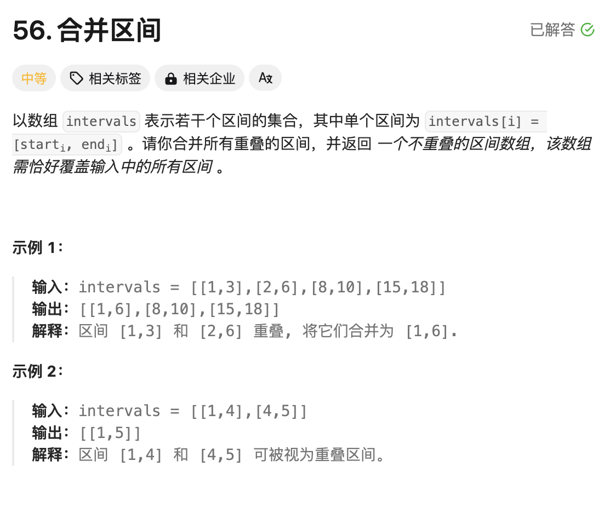
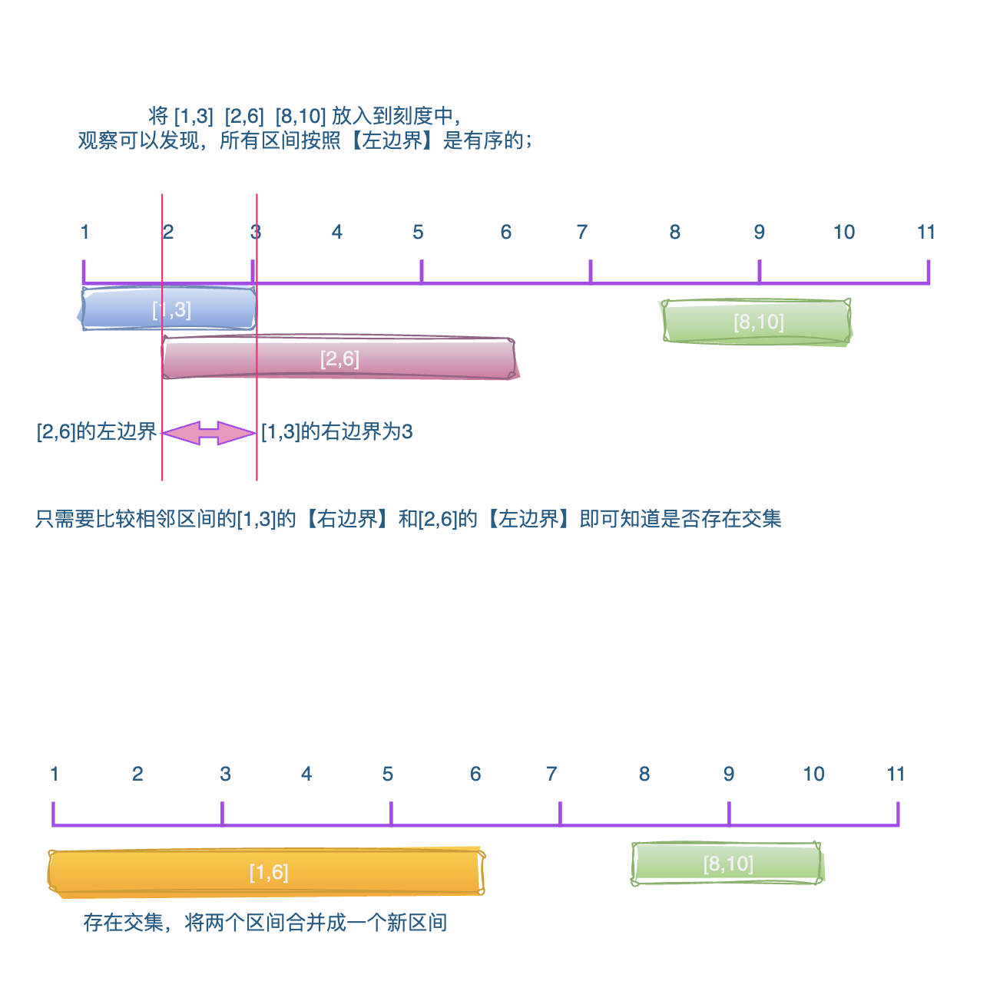

# 题目




# 思路

直接观察区间，相互之间没有任何规律，按照一般的解题方法，将每个区间和其他的区间都一一对比，进行合并。如果我们将区间放入到刻度中区间都是按照【区间左边界】有序的，只需要对相邻的【区间】依次进行合并。

所以放入区间到刻度的过程，就是对**区间排序**的过程；拍完序以后，相邻区间合并。




# 完整代码

```Go

func merge(intervals [][]int) [][]int {
  	//1. 对区间的左边界进行升序排列
    sort.Slice(intervals, func(i, j int) bool {
		return intervals[i][0] < intervals[j][0]
	})
  	
    var result [][]int
  	//2. 前一个区间
    pre := intervals[0] 
    for index := 1 ; index < len(intervals); index++ {
      	//3. 当前区间
        cur := intervals[index] 
        //4. 当前区间左边界 <= 前一个相邻区间的右边界【有交集】
        if cur[0] <= pre[1] {
          	//5. 合并两个区间：取两个区间的右边界最大值
            pre[1] = max(pre[1],cur[1]) 
        } else { 
          	//6. 说明pre和cur的区间没有交集，记录到result中，并将cur当作pre继续比较
            result = append(result,pre)
            pre = cur
        }
    }
  	//7. 【注意】：最后记得将pre中的区间，存储到result中
    result = append(result,pre)
    return result
}

func max(a,b int)int{
    if a > b {
        return a
    }
    return b
}
```

