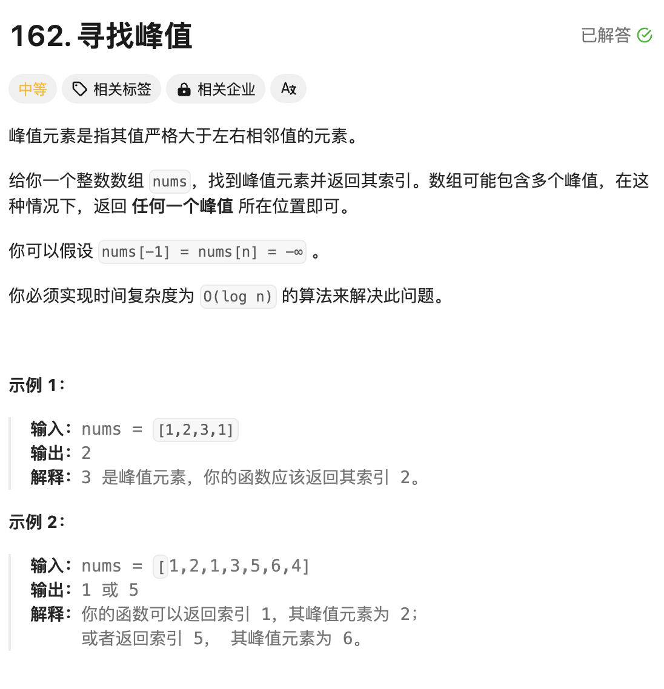

# 题目：[162. 寻找峰值](https://leetcode.cn/problems/find-peak-element/)



# 思路

题目要求：

- nums[-1] = nums[n] = -∞
- 实现时间复杂度为 `O(log n)` 的算法
- 峰值含义：左元素 < 峰值元素 > 右元素，即同时大于左右元素的元素

应该要求时间复杂度为`O(log n)`，所以应该能想到二分法求解。二分法求解代码套路如下:
```
1.定义left / right 两个指针，分别指向数组的两端
2.计算mid = left + (right - left)/2
3.判断mid是否符合题目要求，如果符合返回mid元素
4.如果不符合，左移left++，或者右移right--
```

伪代码如下:

```go
left ,right := 0,len(nums)-1
for left <= right {
  mid := left +( right -left)/2
  
  if mid == target {
    return mid
  } else if mid < target {
    left++
  } else mid > target {
    right--
  }
}
```

在求峰值的时候存在3种情况：

- left < mid值  && mid值 > right，例如[1,3,2]，如果mid指向3，那么mid就是要找的峰值
- left < mid值  && mid值 < right，例如[1,2,3],如果mid指向2，左边满足，右边不满足，那就让mid向右移动，指向3的话，`2 < 3 && 3 >  -∞ 右边界`
- left > mid && mid > right ,例如 [3,2,1],如果mid指向2，右边满足，左边不满足，那就让mid向左移动，指向指向3的话，`2 < 3 && 3 >  -∞ 左边界`

# 完整代码

```go
func findPeakElement(nums []int) int {
    n := len(nums)

    get := func ( i int) int {
        if i < 0 || i >= n  {
            return math.MinInt // 题目要求如果越界，都是无穷小-∞
        }
        return nums[i]
    }
    left,right := 0,len(nums)-1

    for left <= right {
        mid := left + (right-left)/2 // 找到中点元素

        // mid大于相邻的元素
        if get(mid) > get(mid+1) && get(mid) > get(mid-1) {
            return mid
        } else if get(mid) < get(mid+1) { // mid < right
            left = mid+1
        } else if get(mid) < get(mid-1) { // mid < left
            right = mid-1
        }
    }
    return 0
}

```


