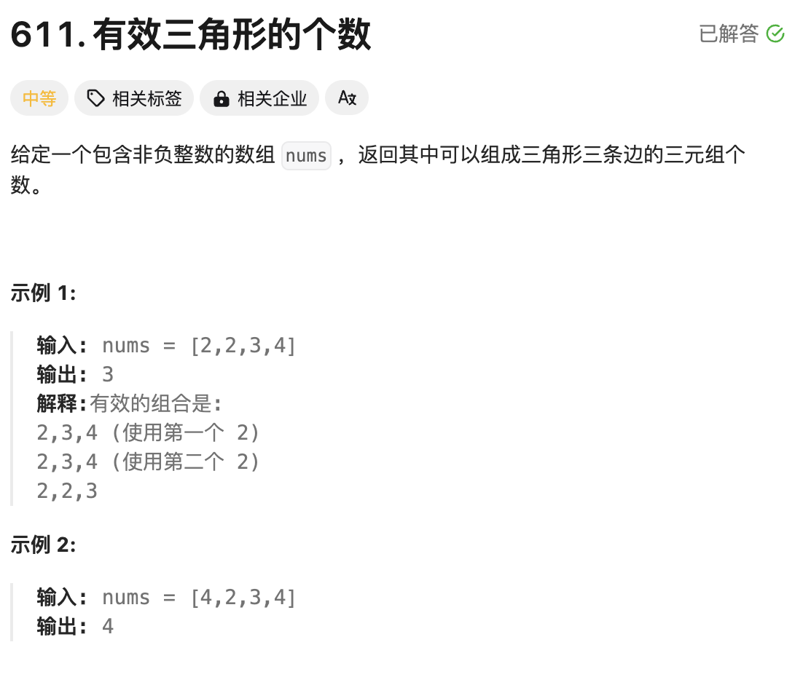
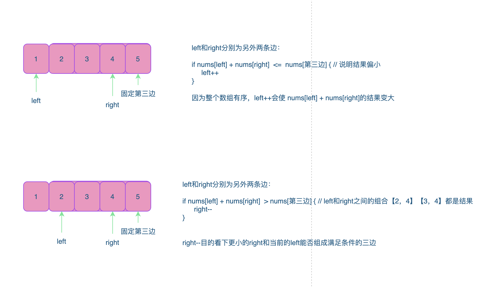

# 题目：



# 思路

- 先对整个数组排序
- 按照两边之和大于第三边的规则；先固定第三边，找满足大于第三边的另外两边



# 完整代码

```go
func triangleNumber(nums []int) int {
    // 组成三角形的三条边的规则：a+b > c 两边之和大于第三边
    //1.先对数组排序(升序排列)
    sort.Ints(nums)

    //2.从数组的尾部倒序开始，先固定一条边；然后从剩下的元素中找满足规则的剩余的两条边；
    res := 0
    for k := len(nums)-1;k >=2;k-- { // 这里注意k的最终的位置索引2的位置，前面剩余索引0和索引1；k不可能到1，因为这样的话，前面剩余的元素组不能组成两条边；三角形的边是3条，宝子们；   
        l,r := 0,k-1 // 表示剩余的两条边索引位置

        for l < r {

            if nums[l] + nums[r] > nums[k] {// 如果l和r索引位置的和大于k，因为数组是递增的，那么l到r之间的元素都是满足结果的两条边;(这个要理解)，所以以r为尾部，可以组合成 r-l中可能；(例如：l , l+1 ... 一直到 r-1的位置和r组合)
                res += r-l
                r-- // 说明以r为结尾的组合没问题，看下更小的r作为尾部能否达成规则
            } else {
                // 说明l + r不满足，那就让l变大一些（因为数组是递增）
                l++
            }
        }
        
    }
    return res
}
```

