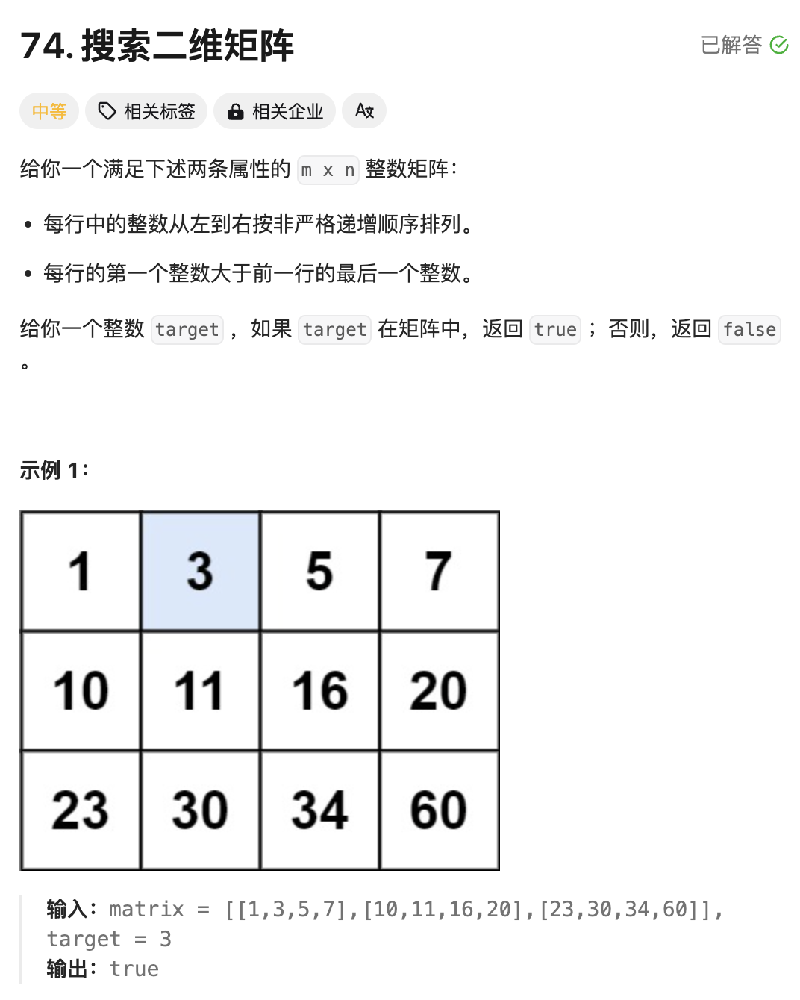
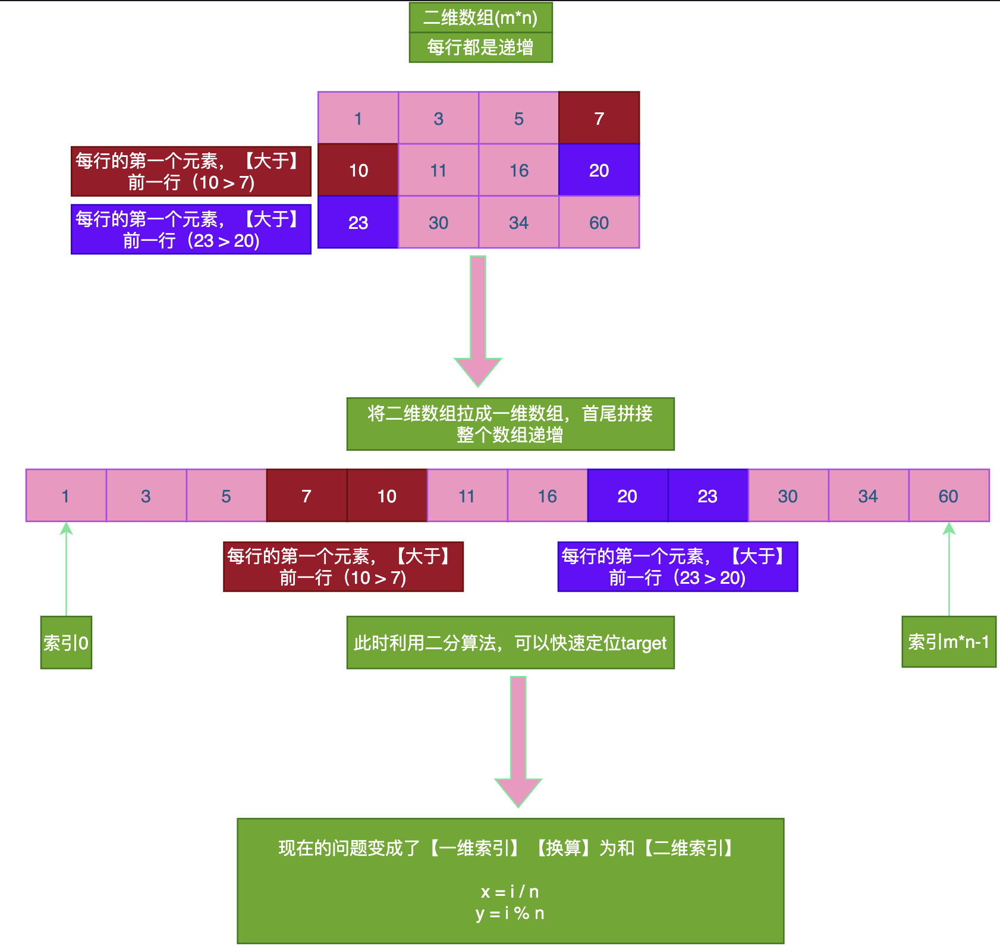

# 题目



# 思路

本题就是标准的二分解法。技巧点：在于能把**二维数组转化成一维数组进行思考**。



将整个二维数组当作一维数组进行二分搜索。

伪代码如下:

```go
left ,right := 0,len(nums)-1
for left <= right {
  mid := left +( right -left)/2
  if mid == target {
    return mid
  } else if mid < target {
    left++
  } else mid > target {
    right--
  }
}
```

本题的`left = 0 right = m*n-1`具体看完整代码逻辑

# 完整代码

```go
func searchMatrix(matrix [][]int, target int) bool {
    // 观察二维矩阵可以发现，如果变成一维数组的话，就是一个递增的数组；查询target，就可以使用二分法查找；
    // 所以思路转变成，二维坐标值和一维坐标值之间的转化；
    //二维[i,j]对应一维 index = i*n +j, n表示一行有n个元素
    //一维index对应的二维i = index /n , j = index %n

    m := len(matrix)
    n :=  len(matrix[0])

    left := 0 // 一维数组的第一个索引
    right := m *n -1 // 一维数组的最后一个索引

    for left <= right {
        mid := left + (right-left)/2 
        // 判断一维数组的中点元素的值和target的大小比较
        val := getVal(matrix,mid)
        if val == target {
            return true
        } else if val < target {
            left = mid+ 1
        } else if val > target {
            right = mid-1
        }
    }
    return false
}

// 通过一维索引获取二维索引
func getVal(matrix [][]int, index int) int {
    n := len(matrix[0]) //注意：这里是列值，不是m
    i := index / n
    j := index % n
    return matrix[i][j]
}
```


