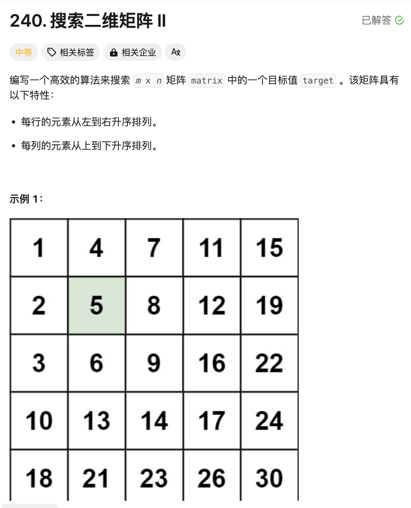
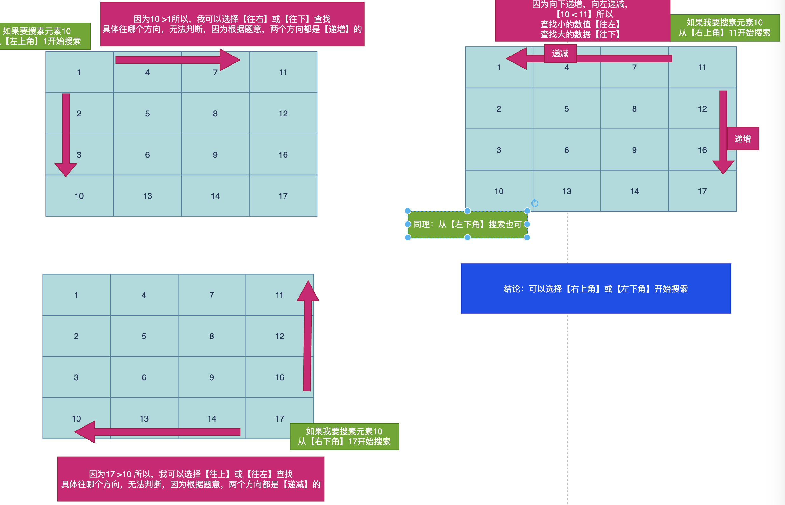

# 题目



# 思路

本题如果采用一般的暴力解法直接全部遍历一遍即可，但是没有利用到题目给的每行/每列有序的特性。



本题我选择从【右上角】开始搜索，当要查找更大的值，可以明确的向下继续查找；当要查找更小的值，可以明确的向左继续查找。和二分法的思路很相似。

# 完整代码

```go
func searchMatrix(matrix [][]int, target int) bool {
    // 正常思路：遍历二维矩阵；但是每一行和每一列的元素都是有序的；
    //那么如果从【左上角】开始比较，当target大于左上角的数值的时候，有两个选择，【向右】或【向下】
    //那么如果从【右上角】开始比较，当15> target的时候，说明target比较小，那么只能向左查找，因为如果向下，元素值更大。不符合题意，也就是此时只会有一种选择

    m := len(matrix)
    n := len(matrix[0])
  	// 【右上角】
    i := 0
    j := n-1

    for i < m && j >= 0 {
        if matrix[i][j] == target {
            return true
        } else if matrix[i][j] > target { // 向左移动,找更小值
            j--
        } else if matrix[i][j] < target { // 向下移动，找更大值
            i++
        }
    }
    return false
}
```


