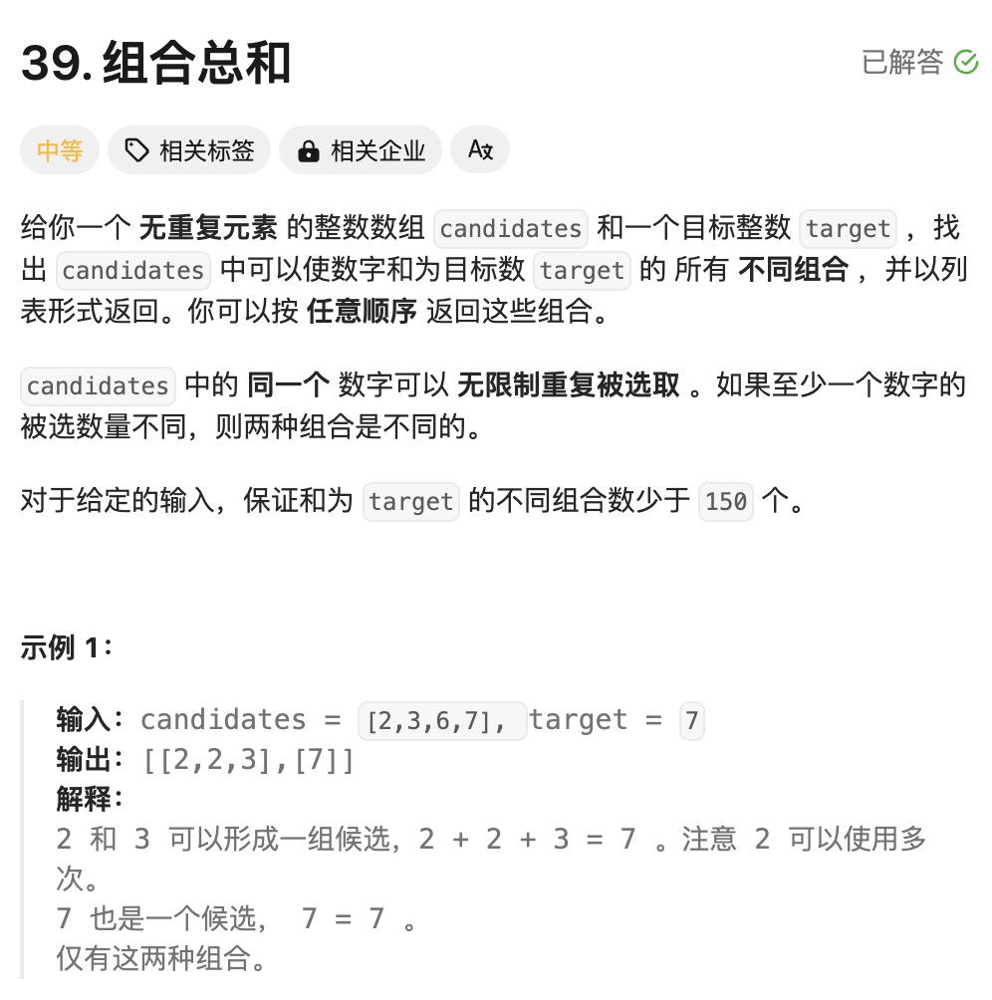
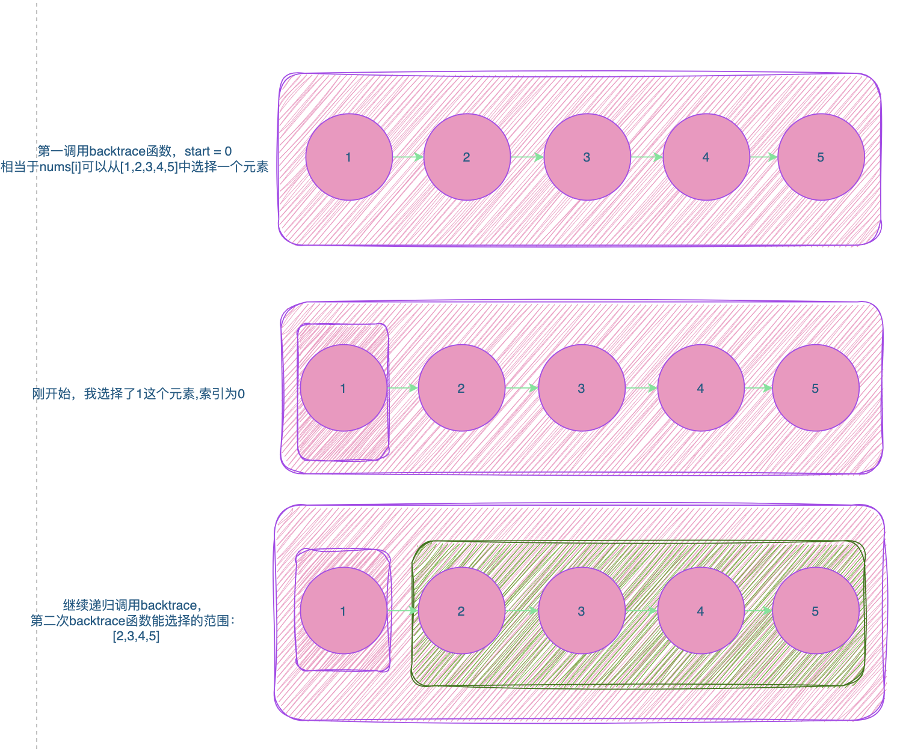
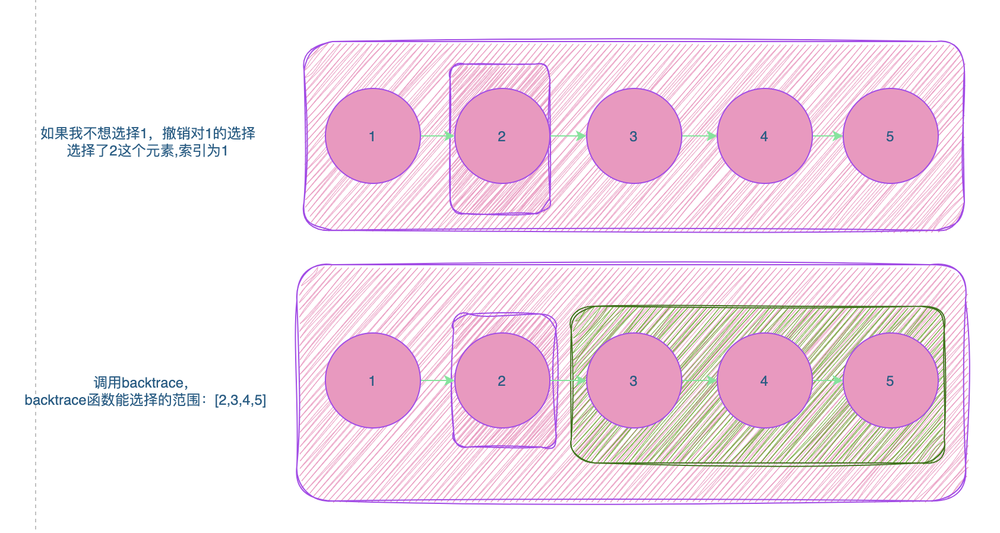

题解仓库：https://github.com/gofish2020/leetcode_forever

# 题目：[39. 组合总和](https://leetcode.cn/problems/combination-sum/)



# 思路

## 如何理解递归调用？

```go
第一种理解方法：
1.明确递归函数的定义：比如函数定义为（从一堆苹果中，拿出来一颗苹果）
2.当我本次拿出来一颗苹果以后，我继续调用函数，是不是继续拿一颗出来
3.取苹果总要有个度，如果堆里面没有苹果了，那肯定就不能再拿了

func TakeOneApple( appleGroup []int) {
	//3.取苹果总要有个度，如果堆里面没有苹果了，那肯定就不能再拿了
  if len(appleGroup) == 0 {
    return
  }
  
  
	//1.从一堆苹果appleGroup中获取一颗苹果
  apple := appleGroup[len(appleGroup)-1]
	
  //2.剔除已经被取走的苹果，剩下的苹果
  appleGroup = appleGroup[:len(appleGroup)-1]
  //3.继续拿一颗苹果
	TakeOneApple(appleGroup)
}

第二种理解方法（更直观的方法）：
1.直接把调用TakeOneApple(appleGroup)的函数展开,带入到调用的地方【如下...展开...】部分，不过容易让人走火入魔🐶

func TakeOneApple( appleGroup []int) {
	//3.取苹果总要有个度，如果堆里面没有苹果了，那肯定就不能再拿了
  if len(appleGroup) == 0 {
    return
  }
  
  
	//1.从一堆苹果appleGroup中获取一颗苹果
  apple := appleGroup[len(appleGroup)-1]
	
  //2.剔除已经被取走的苹果，剩下的苹果
  appleGroup = appleGroup[:len(appleGroup)-1]
  
  //3.在这里我们直接把 TakeOneApple(appleGroup) 函数展开
  ....展开....
	//TakeOneApple(appleGroup)
  if len(appleGroup) == 0 {
    return
  }
  apple := appleGroup[len(appleGroup)-1]
  appleGroup = appleGroup[:len(appleGroup)-1]
  ....展开....
}
```

## 回溯算法代码套路

```go
//backtrace函数定义：从nums中获取元素加入到trace结果中
func backtrace(nums []int, start int, trace []int) {
  // 递归结束条件
  if start == len(nums) {
    return
  }
  
  // 当前元素范围:[start,len(nums)-1]
  for i := start;i < len(nums);i++ {
    //选择：nums[i]加入trace中
    trace = append(trace,nums[i])
    
    //继续下一个元素的拿取，范围：[start+1,len(nums)-1]
    backtrace(nums,i+1,trace)
    
    //撤销选择：加入到trace中的元素nums[i]剔除
    trace = [:len(trace)-1]
  }
}
```






# 完整代码

本题有需要注意的点：

-  **同一个** 数字可以 **无限制重复被选取**
- 组合：不是排列。比如 [1,2]和[2,1]是同一个组合，只要[1,2]一个结果即可。如果要求的是排列[1,2]和[2,1]都是结果
- 结果值要满足等于target

基于前面的前缀知识，代码应该很容易理解

```go
var result [][]int
func combinationSum(candidates []int, target int) [][]int {
    //回溯算法
    result = [][]int{}
    trace := []int{}
    backtrace(candidates,0,trace,target,0)
    return result
}

// 必须要有start，表示下一个选择的起始位置，需要索引 i 从start作为开始，而不是每次都从0开始；如果是从0开始，得到的结果是排列，而不是组合；比如 12 和 21 是同一种组合，但是是不同的排列；target都是3  
func backtrace(candidates []int, start int,trace []int,target int,sum int) {
  	// 这里sum的作用是为了对trace和做记录
    if sum == target { // 得到一组结果
        temp := make([]int,len(trace))
        copy(temp,trace)
        result = append(result,temp)
        return
    }

    if sum > target { // 说明结果比较大，没必要继续递归，因为nums中的元素都是整数，加入的新元素只会让sum更大
        return
    }
	
    // 说明sum < target
    for i := start;i < len(candidates);i++ {
      	// 将nums[i]元素加入结果
        trace = append(trace,candidates[i])
        sum += candidates[i]
      	// 从剩下的nums中，选择下一个元素（联想前面苹果的例子）
        backtrace(candidates,i,trace,target,sum) // 注意： 同一个 数字可以 无限制重复被选取，所以是i，而不是i+1
      	// 将nums[i]元素从结果中撤销
        trace = trace[:len(trace)-1]
        sum -= candidates[i]
    }
}
```

