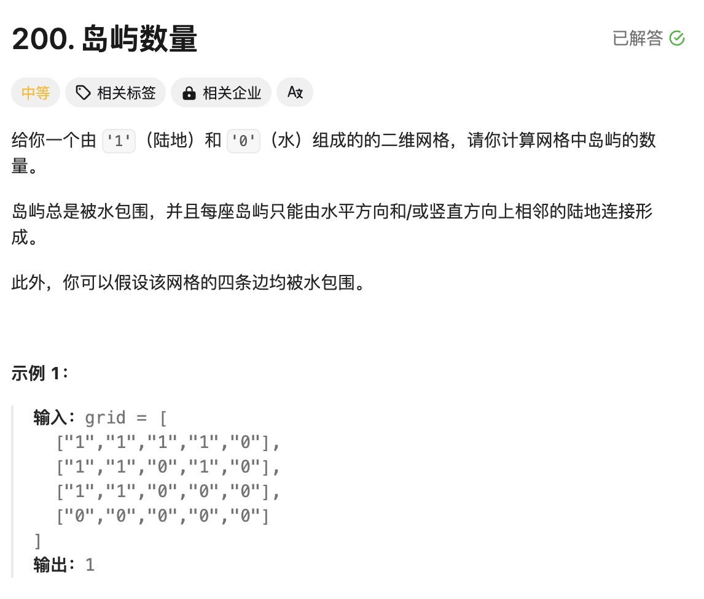

# 题目



# 思路

遍历二维数据，每次遇到1，就将该1周围的所有的1全部都变成0。目的：将1变成0以后，继续遍历二维数据的时候，就不会遇到属于同一个岛屿的1。剩下的1肯定是属于另外的岛屿。**建议看代码，然后结合图片再理解一下**


# 完整代码

```go
func numIslands(grid [][]byte) int {
    m := len(grid)
    n := len(grid[0])
    result := 0
  	// 遍历二维数据
    for i := 0;i < m;i++ {
        for j := 0;j < n ;j++ {
          	// 每当遇到1，表示一个岛屿
            if grid[i][j] == '1' {
                result++ //岛屿数量+1
              	// 将岛屿[i,j]周围的上下左右全部都淹没为0
                dfs(grid,i,j)
            }
        }
    }

    return result
}

// 理解该函数：首先我们要明确dfs函数的定义：即将[i,j]周围的所有的1变成0
func dfs(grid [][]byte,i,j int) {
    m := len(grid)
    n := len(grid[0])
    if i < 0 || j < 0 || i >= m || j >= n { //越界检测
        return
    }
  	// 如果[i,j]已经是0，不用再淹没
    if grid[i][j] == '0' {
        return
    }
  	// 将当前[i,j]淹没为0
    grid[i][j] = '0' //淹没
  	// 将周围上下左右淹没
    dfs(grid,i-1,j) //上
    dfs(grid,i+1,j) //下 
    dfs(grid,i,j+1) //右
    dfs(grid,i,j-1) //左
}
```


