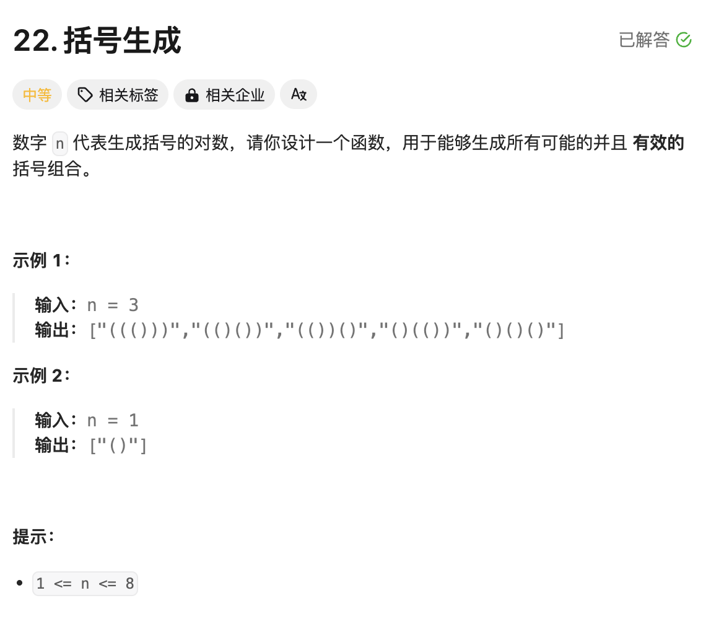

# 题目



# 思路

本题采用回溯算法就是递归调用，理解的核心在于递归函数的定义

### 如何理解递归调用？

```go
1.明确递归函数的定义：比如函数定义为（从一堆苹果中，拿出来一颗苹果）
2.当我本次拿出来一颗苹果以后，我继续调用函数，是不是继续拿一颗出来
3.取苹果总要有个度，如果堆里面没有苹果了，那肯定就不能再拿了

func TakeOneApple( appleGroup []int) {
	//3.取苹果总要有个度，如果堆里面没有苹果了，那肯定就不能再拿了
  if len(appleGroup) == 0 {
    return
  }
  
  
	//1.从一堆苹果appleGroup中获取一颗苹果
  apple := appleGroup[len(appleGroup)-1]
	
  //2.剔除已经被取走的苹果，剩下的苹果
  appleGroup = appleGroup[:len(appleGroup)-1]
  //3.继续再拿一颗苹果
	TakeOneApple(appleGroup)
}
```

### 回溯算法代码套路

```go
//backtrace函数定义：从nums中获取元素加入到trace结果中
func backtrace(nums []int, start int, trace []int) {
  // 递归结束条件
  if start == len(nums) {
    return
  }
  
  // 当前元素范围:[start,len(nums)-1]
  for i := start;i < len(nums);i++ {
    //选择：nums[i]加入trace中
    trace = append(trace,nums[i])
    
    //继续下一个元素的拿取，范围：[start+1,len(nums)-1]
    backtrace(nums,i+1,trace)
    
    //撤销选择：加入到trace中的元素nums[i]剔除
    trace = [:len(trace)-1]
  }
}
```

本题题意拆解为：要生成`n`对括号，肯定就存在`n`个【左括号】和`n`个【右括号】，在一起组成了成对的括号。回溯的时候，每次从中【选择】一个括号，下一次从剩下的括号堆里面再选择一个。

在选择的过程中，总有括号被用完的时候，所以本题的关键在于递归结束条件的理解。

# 完整代码

**递归`backtrack`函数定义：从 `left`个左括号和`right`个右括号中，选择一个括号**

```go

var result []string
func generateParenthesis(n int) []string {
    result = []string{}
    track := []byte{}
    backtrack(track,n,n)
    return result
}

func backtrack(track []byte,left,right int) { //left剩余左括号数量 right剩余右括号数量
  	// left和right括号恰好用完
    if left == 0 && right == 0 {
        result = append(result,string(track))
        return
    }
  	//剩余right < 剩余left，说明right添加多了，不符合题意；例如 )()
    if right < left { 
        return
    }
  	// 说明 left 或 right 括号用超了
    if left < 0 || right < 0 {
        return
    }

    track = append(track,'(') //选择左括号
    backtrack(track,left-1,right)
    track = track[:len(track)-1] //撤销选择

    track = append(track,')') //选择右括号
    backtrack(track,left,right-1)
    track = track[:len(track)-1] //撤销选择
}
```