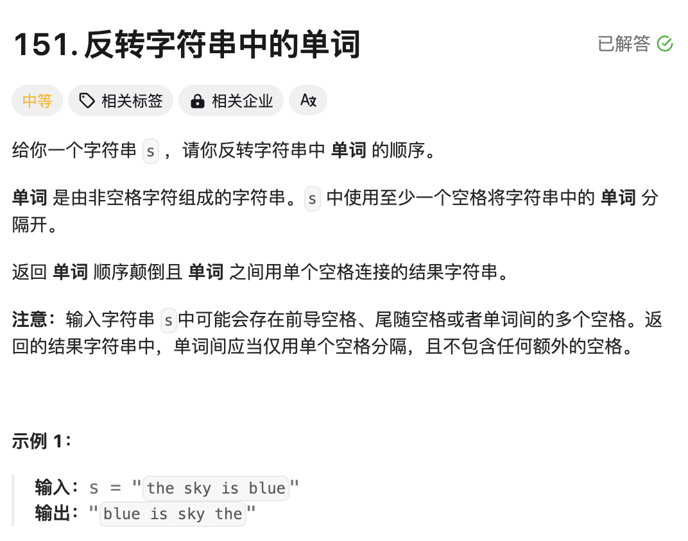
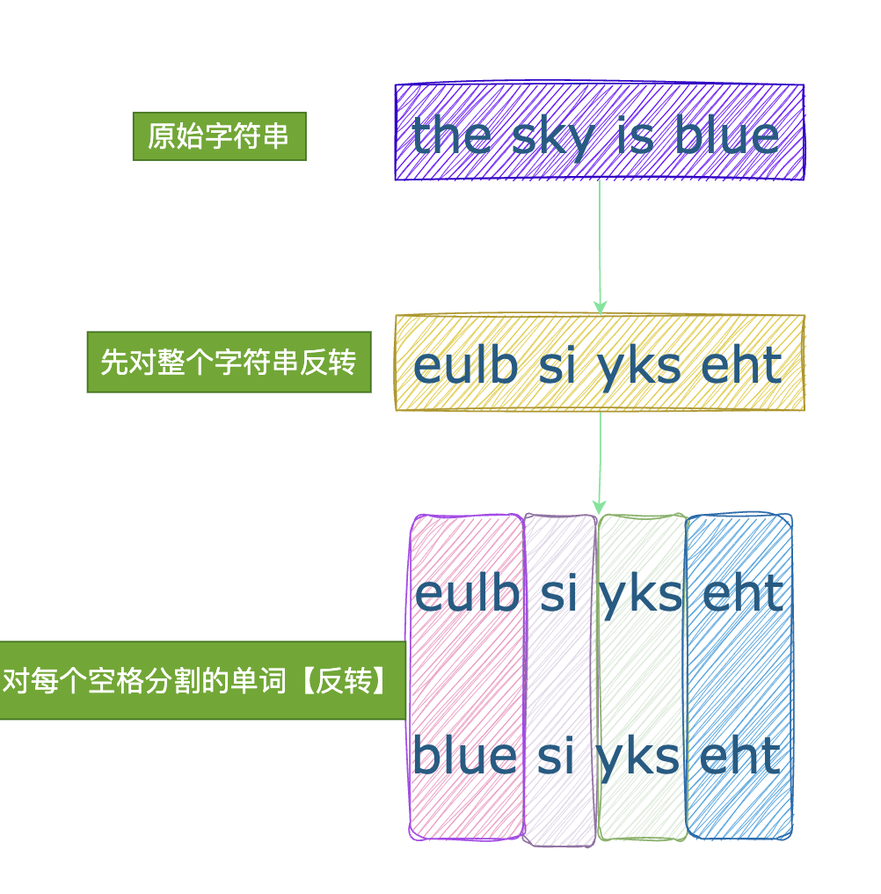

# 题目



# 思路

1. 字符串中存在多余的空格（包括：单词之间有多个空格，前导空格、尾随空格），所以**需要遍历字符串的每个【字符】**，单词多余空格保留一个（前导和尾随空格一个不留）
2. 反转单词顺序



# 完整代码

```go
func reverseWords(s string) string {
    //1.result放置去掉空格后的字符串
    result := []byte{}
  	//2.一个字符一个字符的过滤
    for i := 0;i<len(s);i++ { 
        if s[i] != ' ' {
            result = append(result,s[i])
        } else {
          	//3. 如果当前字符为【空格】，如果result尾部已经是空格，本空格不可加入到结果中
            if len(result) != 0 && result[len(result)-1] != ' ' {
                result = append(result,' ')
            }
        }
    }
    //4.去除尾部最后一个空格
    if result[len(result)-1] == ' ' {
        result = result[:len(result)-1]
    }
    //5.翻转整个字符串
    reverse(result,0,len(result)-1)

    //6.翻转每个单词
    for i := 0;i < len(result); {
      	// 固定左边界i
        for j := i;j < len(result);j++ {
          	// 查找单词的右边界j
            if j + 1 == len(result) || result[j+1] == ' ' { //空格or字符串尾部，都是一个单词的边界
                reverse(result,i,j)
                //开始下一个单词，【跳过结尾字符和空格】
                i = j + 2
                break
            }
        }
    }
    return string(result)
}

func reverse(word []byte,i,j int){
  	// 首尾字符交换
    for i < j {
        word[i],word[j] = word[j],word[i]
        i++
        j--
    }
}
```


