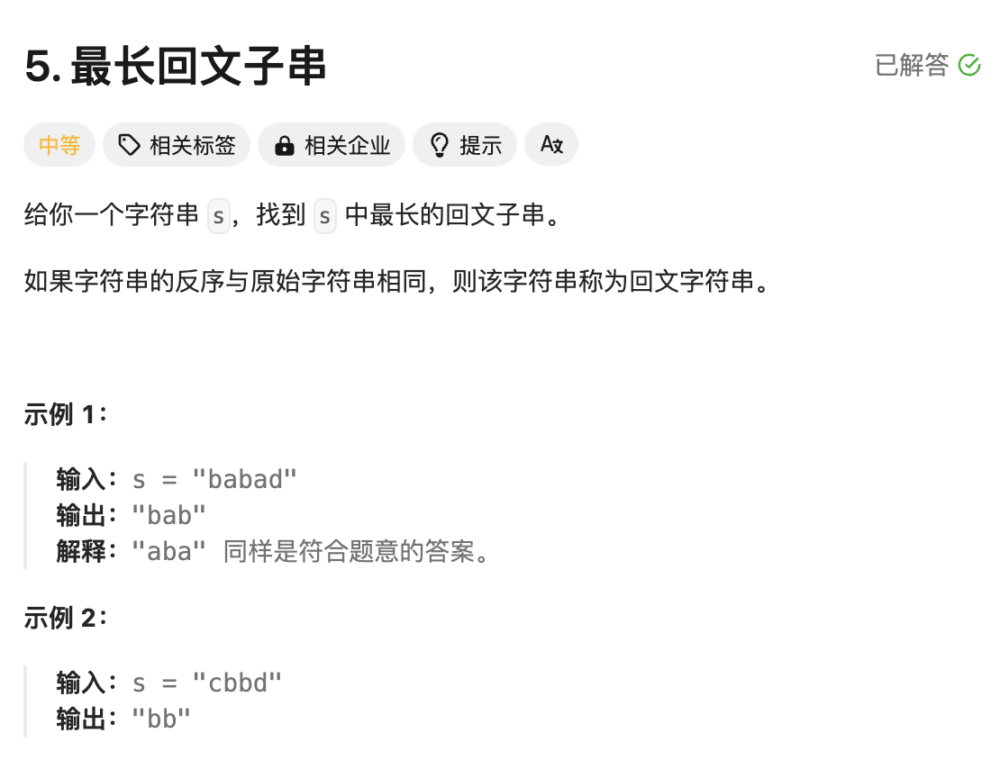
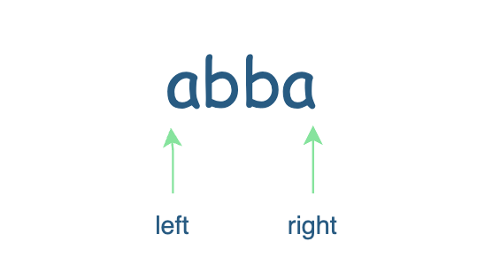
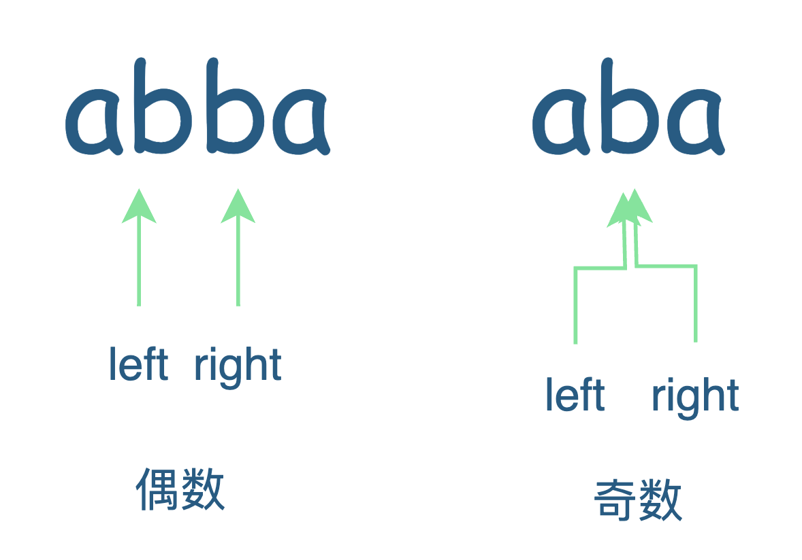
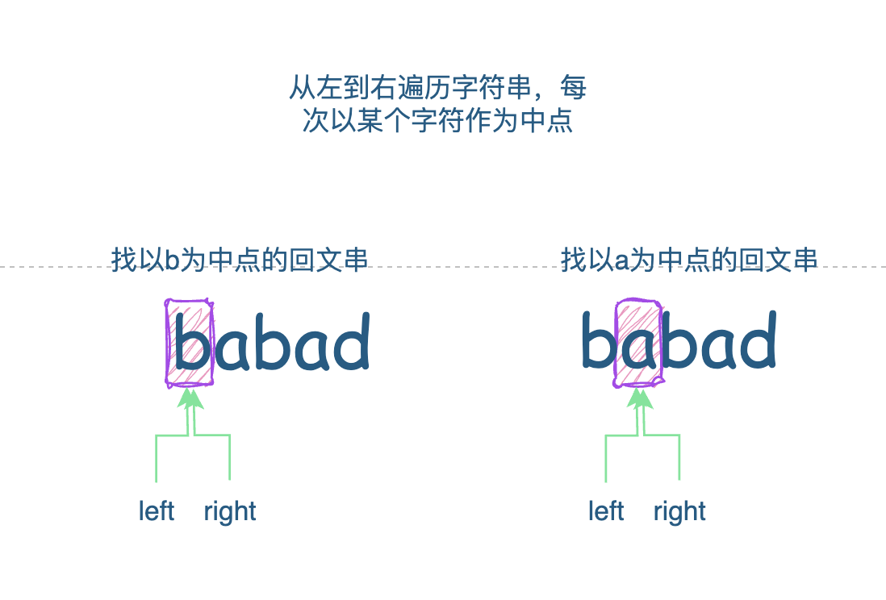
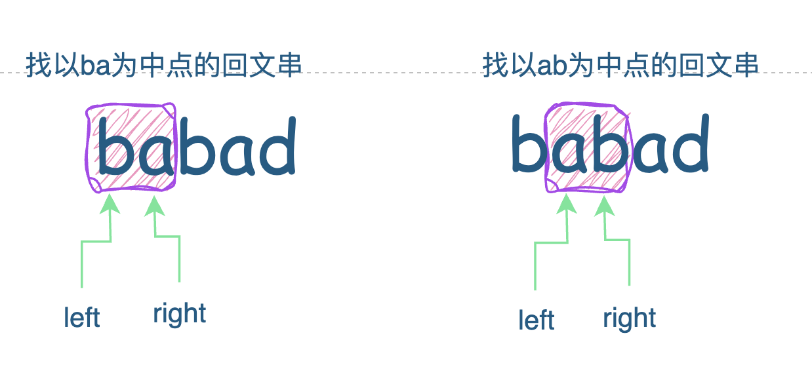

# 题目



# 思路

如何判断一个字符串是回文？

有两种方案：

- 方案1:**两边向中间收缩**。定义两个指针，指向字符串的两边，判断`left `和`right`是否相同，如果相同`left++ && right--`



伪代码如下:
```go
s := "abba"
func IsPalindrome(s string) bool {
  left,right := 0,len(s)-1
  for left <= right {
    if s[left] == s[right] {
      left++
      right--
    } else {
      return false
    }
  }
  return true
}

```

- 方案二：**中间向两边扩展**。需要先找到字符串的中点，但是字符串的字符个数又分为**奇数**or**偶数**个。所以中点可以是同一个位置，也可能是两个位置



伪代码如下：

```go
func IsPalindrome(s string) bool { 
  mid := len(s)/2
  left,right := 0,0
  if len(s) % 2 == 0 { // 偶数
    left = mid-1
    right = mid
  } else { // 奇数
    left,right = mid,mid
  }

  for left >= 0 && right < len(s) {
    if s[left] == s[right] {
      left--
      right++
    } else {
      return false
    }
  }
  return true
}

```

本题的思路需要用到第二种方案：首先我们需要从左到右遍历字符串，然后以每个字符作为回文串的中点，向左右两边扩展，找到以本字符为中点的回文串



中点不一定是一个点，还可能是两个点作为回文串的中点；所以还要针对相邻的两个点判断回文串



# 完整代码

```go
func longestPalindrome(s string) string {

    var result string

    for i := 0;i< len(s);i++ {
      	// 以i为中点，找回文串
        s1 := isPalidrome(s,i,i)
        if len(s1) > len(result) {
            result = s1
        }
      	// 以i和i+1为中点，找回文串
        s2 := isPalidrome(s,i,i+1)
        if len(s2) > len(result) {
            result = s2
        }
    }
    return result
}


func isPalidrome(s string, left, right int ) string {
    if left > right {
        return ""
    }
    for left >=0 && right <= len(s)-1 {
        if s[left] == s[right] {
            left--
            right++
        }else {
            break
        }
    }
  	// 执行到这里，说明left和right指向到值【不同or越界】，截取回文串
    return string(s[left+1:right])
}
```


