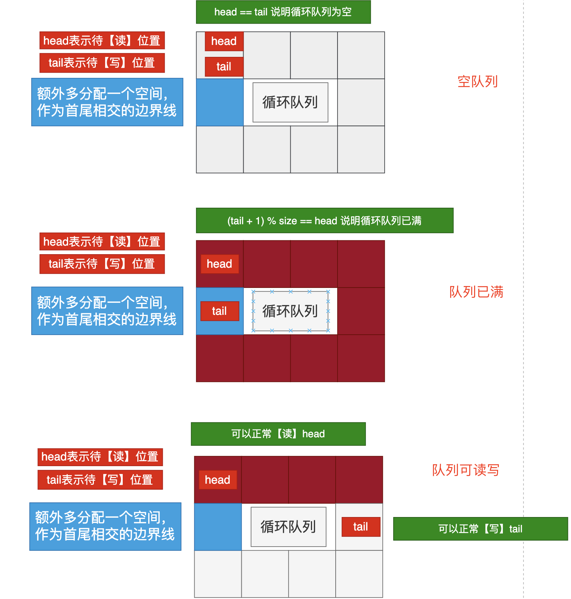

# 题目


# 思路

理解的关键在于`head`和`tail`的含义：

- `head`可以读取数据位置，前提队列不能为【空】
- `tail`表示即将放入新元素的位置（但是tail中还没有放入），前提队列不能【满】
- 在分配队列大小的时候，多分配一个元素空间，作为`tail`和`head`再次重叠的时候，判断是因为为空重叠，还是因为满重叠。



# 完整代码

```go

/*
1.获取数据的时候，首先判断 head == tail （说明没有数据）；
2.放入的时候，要先判断【head的下一个节点】是不是tail，如果是的话，说明已经满了，不能再放入新数据了；
*/

type MyCircularQueue struct {
    data []int // 用数组作为底层的数据结构
    head int // 【读】位置
    tail int // 【写】位置
  	size int // 队列大小（包括额外分配的元素)
}


func Constructor(k int) MyCircularQueue {
    return MyCircularQueue {
        data: make([]int,k+1),// 多分配一个
        head:0,
        tail:0,
        size:k+1, // 多分配一个
    }
}


func (this *MyCircularQueue) EnQueue(value int) bool {
  	// 队列已满，不能入队
    if this.IsFull() {
        return false
    }
  	// 入队的位置就是tail指向的位置
    this.data[this.tail] = value
  	// 入队新元素后，tail移动到下一个待写入位置
    this.tail = (this.tail+1)%this.size
    return true
}


func (this *MyCircularQueue) DeQueue() bool {
  	// 队列为空，不能出队
    if this.IsEmpty() {
        return false
    }
  	// 出队，只需要head移动一位即可（不用清空内部的元素值）
    this.head = (this.head+1)%this.size
    return true
}


func (this *MyCircularQueue) Front() int {
  	// 队列为空
    if this.IsEmpty(){
        return -1
    }
  	// 队头元素
    return this.data[this.head]
}


func (this *MyCircularQueue) Rear() int {
  	// 队列为空
    if this.IsEmpty() {
        return -1
    }
  	// 队尾元素(tail指向的是待写入位置，往前移动一位才是队尾元素)
    return this.data[(this.tail-1+this.size)%this.size]
}


func (this *MyCircularQueue) IsEmpty() bool { 
  	// head和tail指向同一个位置，说明为空
    return this.head == this.tail
}


func (this *MyCircularQueue) IsFull() bool {
  	// tail的下一个位置和head相同，说明满
    return (this.tail+1)%this.size == this.head
}


/**
 * Your MyCircularQueue object will be instantiated and called as such:
 * obj := Constructor(k);
 * param_1 := obj.EnQueue(value);
 * param_2 := obj.DeQueue();
 * param_3 := obj.Front();
 * param_4 := obj.Rear();
 * param_5 := obj.IsEmpty();
 * param_6 := obj.IsFull();
 */
```


