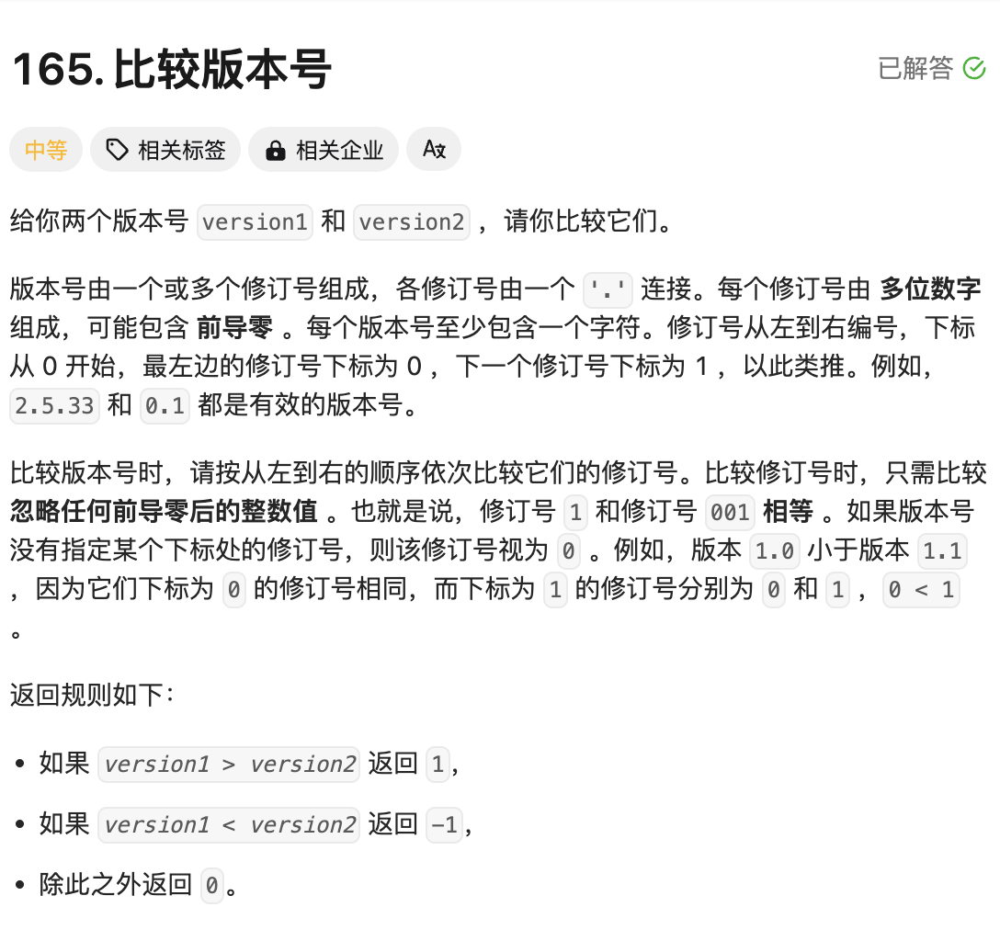

# 题目



# 思路

解题关键点：

- 版本号是多个修订号，用 `"."`分割组成；
- 每个修订号的数值会存在前导零【需要忽略前导零】，比如 `001`和`1`就是相同值；
- 版本号长度不一定相同；比如 `1.0`和`1.0.0`就是相同的版本号，所以需要从左到右进行一一比较

所以解题关键在于，先按照 `'.'`将字符串`version`切分，然后从左向右对比 `version1`和`version2`对应位置的子串数值是否相同

# 完整代码

```go
func compareVersion(version1 string, version2 string) int {
    //1.先按照"." 拆分字符串
    slicev1 := strings.Split(version1,".")
    slicev2 := strings.Split(version2,".")

    //2.对应位置一一对比
    i,j := 0,0 
    for ; i < len(slicev1) && j < len(slicev2);i,j = i+1,j+1 {
        val1 ,_ := strconv.Atoi(slicev1[i])
        val2,_ := strconv.Atoi(slicev2[j])
        if val1 > val2 { // 如果version1版本大，直接返回1
            return 1
        } else if val1 < val2 { // 如果version2版本大，直接返回-1
            return -1
        }
    }
  	// 3. 执行到这里，说明version1的分割出来的版本长度更长
    for i < len(slicev1) {
        val1 ,_ := strconv.Atoi(slicev1[i])
        i++
        if val1 > 0 { // version2不存在的版本，默认为0
            return 1
        }else if val1 < 0 {
            return -1
        }
    }
		
  	// 4. 执行到这里，说明version2的分割出来的版本长度更长
    for j < len(slicev2) {
        val2,_ := strconv.Atoi(slicev2[j])
        j++
        if val2 > 0 { // version1不存在的版本，默认为0
            return -1
        }else if val2 < 0 {
            return 1
        }
    }
  	// 5.说明上面执行完成以后，两个版本完全一样
    return 0
}
```

