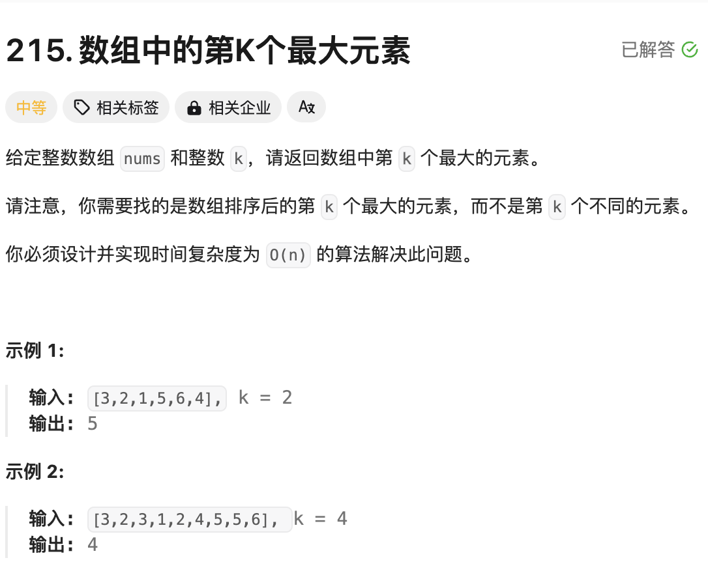
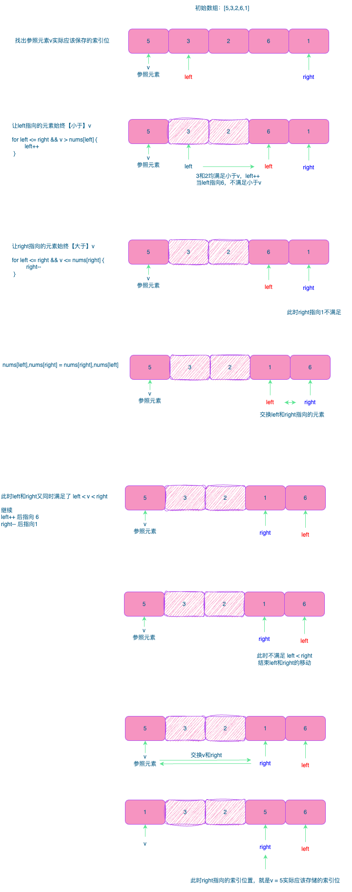

# 题目：数组中第K个最大元素



# 思路

- 题目要求第`k`个最大的元素

例如有升序数组 `[1,2,3]`第1个最大的元素是3【索引值为 2】，第2个最大元素是2【对应的索引值为1】，所以第`k`个最大元素的索引值为` len(nums) - k `

- 快速排序



通过这一轮排序，可以将元素5存储到正确的位置，同时可以知道元素存储的索引值为`right`，判断`right`是否等于我们想求的索引位 `len(nums) - k `,如果相同说明`right`指向的元素就是我们要找的第 `k`个最大元素；

如果 `  len(nums)- k < right `说明 要找的索引位在`right`的【左边子数组】中，我们只需要对左边的子数组继续进行快速排序；

如果 ` right < len(nums) - k ` 说明 要找的索引位在`right`的【右边子数组】中，我们只需要对右边的子数组继续进行快速排序；

# 完整代码

```go
func findKthLargest(nums []int, k int) int {
    //求第k大的元素，数组按照正序排列，第k大元素的索引位置为：len(nums)-k
    index := len(nums) - k
    lo,hi := 0,len(nums)-1
    for {
        idx := quickSort(nums,lo,hi) // 对[lo,hi]范围的元素进行快速排序，返回索引位
        if index == idx { // 返回的索引位idx正好和预期的index相同，说明idx指向的元素就是我们要找的元素
            return nums[idx]
        } else if index < idx { // 说明要找的元素在 idx 的【左子数组】中
            hi = idx-1
        } else { // 说明要找的元素在 idx 的【右子数组】中
            lo = idx+1
        }
    }

    return 0
}

// 利用快速排序，找一个参照元素v，使左边的元素都小于v，右边的元素都大于等于v
func quickSort(nums []int ,lo,hi int) int {
    
    v := nums[lo] // 参照元素值

    left := lo+1
    right := hi


    for left <= right {
        for left <= right && v > nums[left] { // left都要比v小
            left++
        }

        for left <= right && v <= nums[right] { // right都要比v大
            right--
        }
        if left > right {
            break
        }

        // 执行到这里，说明left和right的元素不满足左小右大的规则，交换left和right
        nums[left],nums[right] = nums[right],nums[left]
    }
    // 最后交换 lo和right
    nums[lo],nums[right] = nums[right],nums[lo]
    return right
}
```

