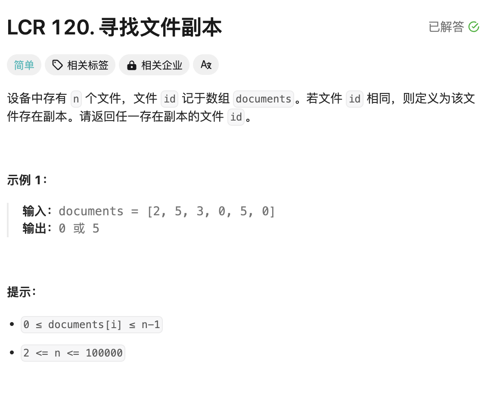
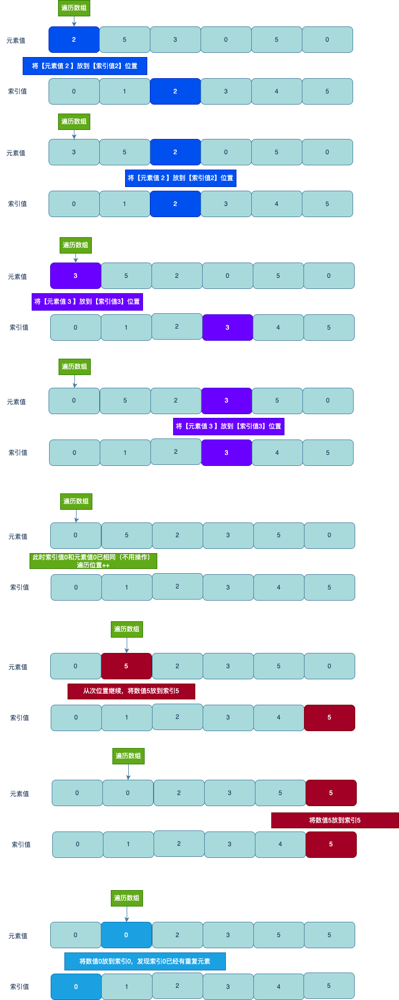

# 题目



# 思路

数组中的【元素值】和【索引值】的取值范围一样 ` 0 <= documents[i] <= n-1`，这个信息很关键。

- 代码理解的关键在于 `nums[i]`既表示元素值，又代码索引值
- 当发现元素值`nums[i]`和索引值 `i`本身就相同的时候，才对`i++`，否则要对`i`位置的元素`nums[i]`一直进行保存到索引位的操作



# 完整代码

```go
func findRepeatNumber1(nums []int) int {
    for i := 0;i < len(nums); {
      	// 索引和元素值相同，跳过（因为我们本身就是想把元素值放到相同的索引位置下）
        if i == nums[i] { 
            i++ // 不能无脑的i++
            continue
        } else { 
          	// 看下元素值nums[i]，作为索引的时候，索引上面的元素值nums[nums[i]]和当前的元素值nums[i]是否相同；相同说明重复
            if nums[i] == nums[nums[i]] {
                return nums[i] // 重复数
            } else { 
              	// 目的：让元素值nums[i]放到索引nums[i]位置（不理解看下上图）
                nums[i],nums[nums[i]] = nums[nums[i]],nums[i] 
            }
        }
    }
    return 0
} 
```


