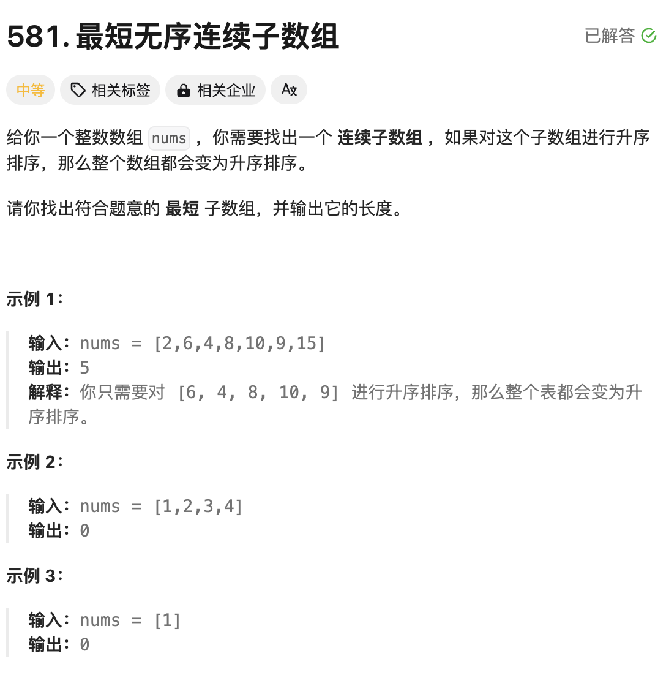

图文题解仓库地址: https://github.com/gofish2020/leetcode_forever

# 题目：[581. 最短无序连续子数组](https://leetcode.cn/problems/shortest-unsorted-continuous-subarray/)



# 思路

题目要求应该不难理解，就是原始的数组，有一段的子数组是乱序的，将这段乱序数组有序排列以后，整个数组就变成有序的。问题在于怎么知道这个乱序子数组的左边界/右边界，采用单调栈分别求解左边界/右边界。

这里以求左边界为例：

从左向右遍历`nums`数组，并入栈元素，始终保持栈中元素从栈底到栈顶**升序排列**


实际在代码里面，栈中保存的是索引值而并非元素值，在元素4（索引值2）剔除元素6（索引值1）的时候，我们记录下来元素6的索引值1

在元素9（索引5）剔除元素10（索引4）的时候，我们记录下元素10的索引值4

取最小的索引值1，就是乱序数组的左边界。

同理，求乱序数组的右边界，我们要保证从栈底到栈顶是**降序排序**,代码逻辑相似，要保存索引值的最大值，作为右边界。

# 完整代码

```go
func findUnsortedSubarray(nums []int) int {
    // 单调栈
    
    indexStack := []int{} 

    leftIndex := len(nums)-1 //用来记录最左边的最小的索引
    rightIndex := 0 //用来记录最右边最大的索引
  
    for i := 0; i < len(nums);i++ { // 从左向右遍历，保证递增排序
        for len(indexStack) != 0  && nums[i] <  nums[indexStack[len(indexStack)-1]] { // 因为递增，新入栈元素nums[i] 按理应该更大
            // 记录下左边的最小索引呢
            leftIndex = min(leftIndex,indexStack[len(indexStack)-1])
            // 弹出栈顶元素
            indexStack = indexStack[:len(indexStack)-1]
            
        } 
        indexStack = append(indexStack,i)
    }

   
    indexStack = []int{} 
    for i := len(nums)-1;i >=0;i-- { //从右到左遍历，保证递减排序
        for len(indexStack) != 0 && nums[i] >  nums[indexStack[len(indexStack)-1]] { // 因为递减排序，新入栈元素按理应该更小
          	// 记录下右边的最大索引
            rightIndex = max(rightIndex,indexStack[len(indexStack)-1])
            // 弹出栈顶元素
            indexStack = indexStack[:len(indexStack)-1]
        }
        indexStack = append(indexStack,i)
    }

    if leftIndex == len(nums)-1 && rightIndex == 0 { // 说明数组本身就是有序，不存在乱序
        return 0
    }
    return rightIndex-leftIndex+1 // 右边界 - 左边界 + 1
}


func max(a,b int)int{
    if a >b {
        return a
    }
    return b
}


func min(a ,b int)int{
    if a < b{
        return a
    }
    return b
}
```


