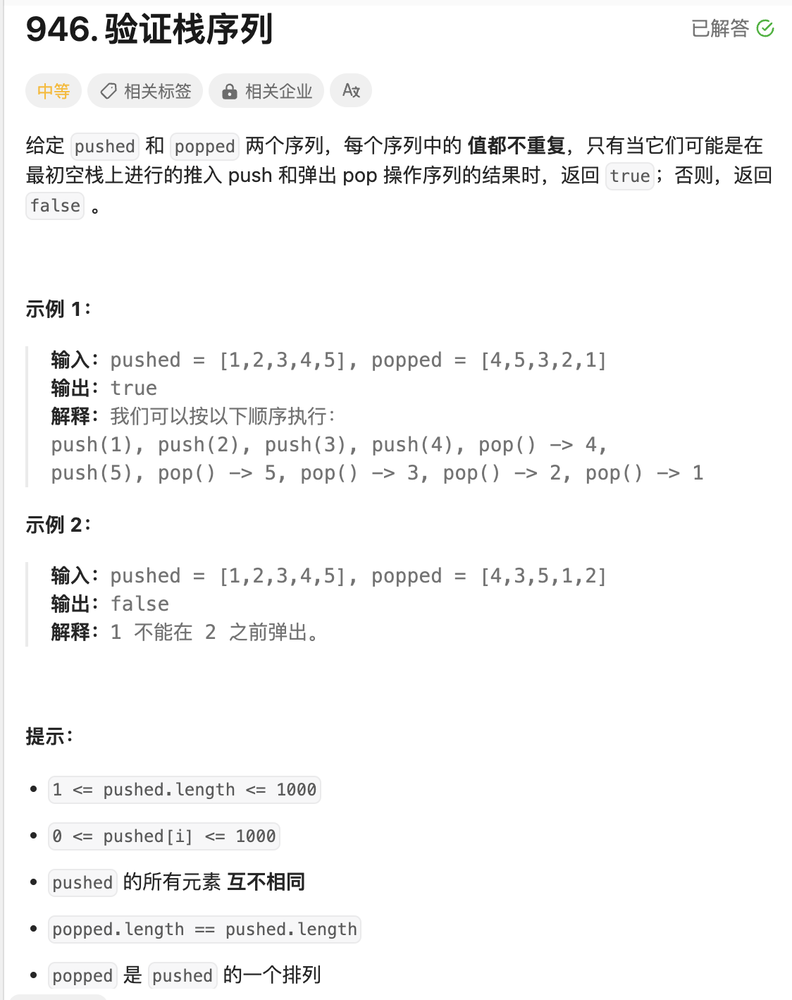
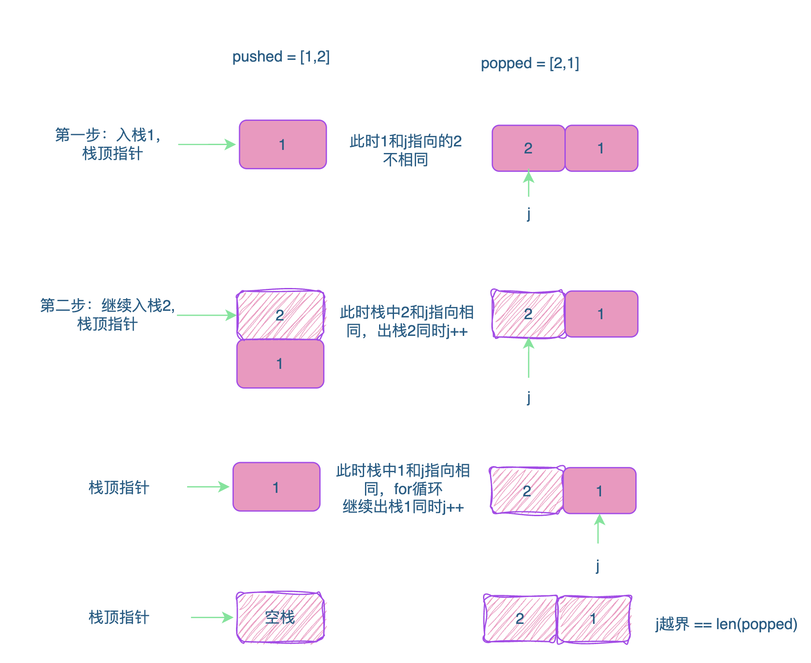

# 题目



# 思路

## 基础知识：Go中栈的基础操作

```go
// 定义栈
stack := []int{}
// 入栈元素1
stack = append(stack,1)
// 入栈元素2
stack = append(stack,2)

//出栈元素2
val := stack[len(stack)-1]
stack = stack[:len(stack)-1]

// 出栈元素1
val := stack[len(stack)-1]
stack = stack[:len(stack)-1]

```


pushed中的元素负责不断入栈，每次pushed入栈一个元素，判断一下该元素是否和popped要出栈的元素是否相等；

如果相同，将入栈的元素出栈，同时指向popped的索引后移一位；

如果不相同，继续将pushed中元素入栈；



# 代码

```go
func validateStackSequences(pushed []int, popped []int) bool {
  	// j 负责指向popped的元素
    j := 0
    //sk表示起始空栈
    sk := []int{}
    // 遍历 pushed
    for _,v := range pushed { 
      	// 每次入栈一个元素
        sk = append(sk,v)
      	// 在sk不为空的前提下，判断sk栈顶元素和popped是中j指向的元素是否相同，相同需要出栈【一直相同一直出栈】
        for len(sk) > 0 && sk[len(sk)-1] == popped[j] {
            j++ // 同时j后移一位
            sk = sk[:len(sk)-1] // 出栈
        }
    }
    return  j == len(popped) // 表示元素全部都出栈完成，和popped中的元素完成匹配
}
```

# 总结

1. 要理解Go代码如何操作栈；
2. 每次入栈一个元素，都要用popped对栈顶元素，进行无底线的for循环出栈；要么sk为空，要么栈顶和popped的元素不相同，不然不罢休


