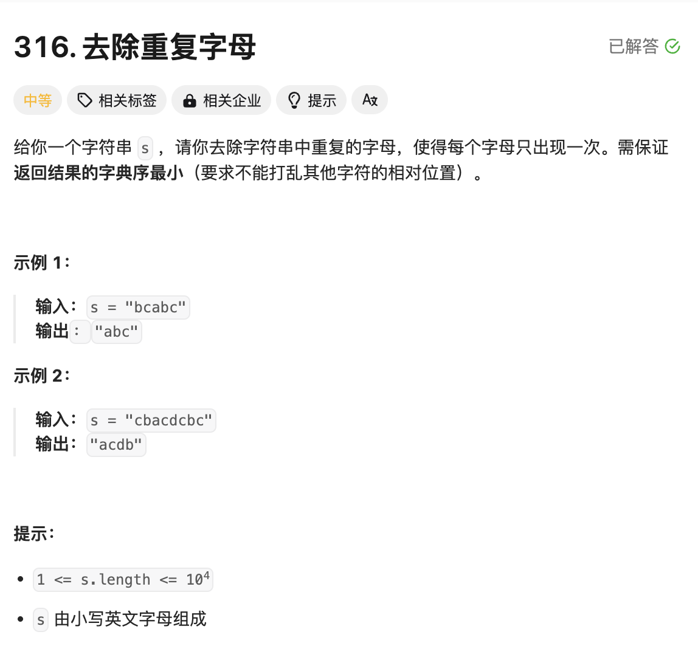
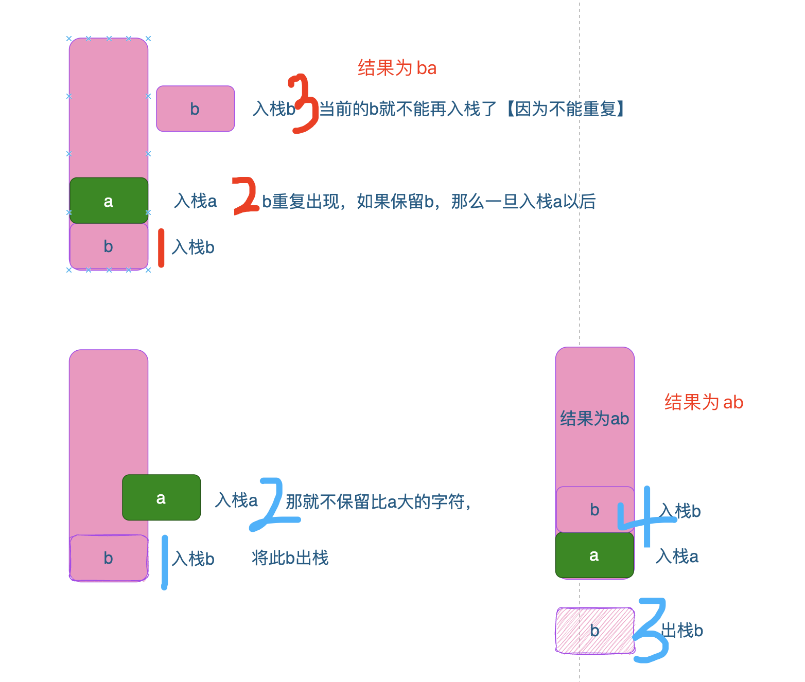

# 题目



# 思路

### 先知道哪些字母是重复的？

- 所以要遍历所有字符，先统计出现的次数

### 如何去除重复？

-  例如`abb`的情况，保存`ab`后，第二个`b`就不能再保存（去重），所以需要记录已经保存了哪些字符

### 字典序最小

- 例如`bab`字符`b`重复，去掉后有两种结果`ba`或`ab`，显然`ab`的字典序最小。可以考虑用栈实现



# 完整代码

```go
func removeDuplicateLetters(s string) string {
    //这题很难想到实现方法：利用栈实现
  
  	//1.统计每个字符出现的次数(因为都是小写字母)
    count := [256]int{} 
    for i := 0;i < len(s);i++ {
        count[s[i]]++
    }
  	// 记录栈中字符是否重复
    innerStack :=[256]bool{}
  	// 保存字符
    stack := make([]byte,0) 
    for i := 0;i < len(s);i++ {
        // 遍历字符，字符剩余次数-1
        count[s[i]]--
      	//该字符，栈中已经存在，例如：abb 先入栈ab以后，第二个b不用再入栈了
        if innerStack[s[i]] == true { 
            continue
        }
      	//和栈中的每个元素进行对比，把比s[i]大的元素弹出，保证字典序
        for len(stack) != 0 && stack[len(stack)-1] > s[i] { 
          // 栈顶字符stack[len(stack)-1] 没有额外的重复字符
            if count[stack[len(stack)-1]] == 0 { 
                break
            }
            //出栈
            innerStack[stack[len(stack)-1]] = false
            stack = stack[:len(stack)-1]
        }
        stack = append(stack,s[i]) //入栈
        innerStack[s[i]] = true 
    }
    //拼接为字符串
    return string(stack)
}
```

