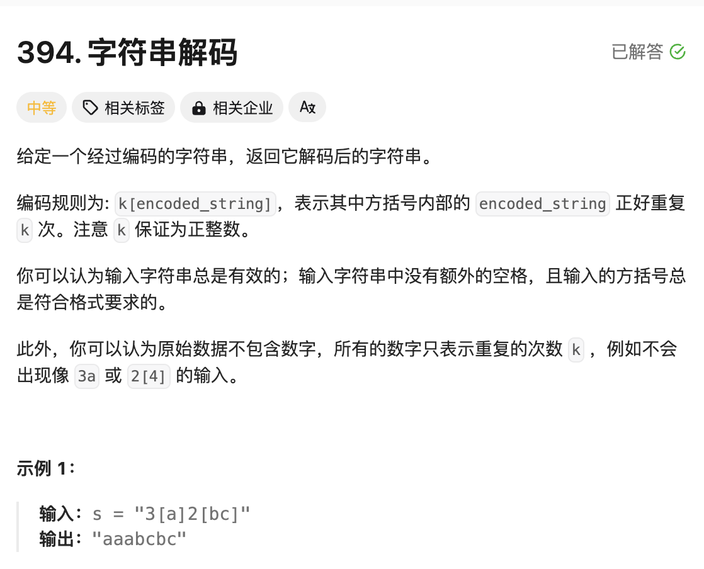
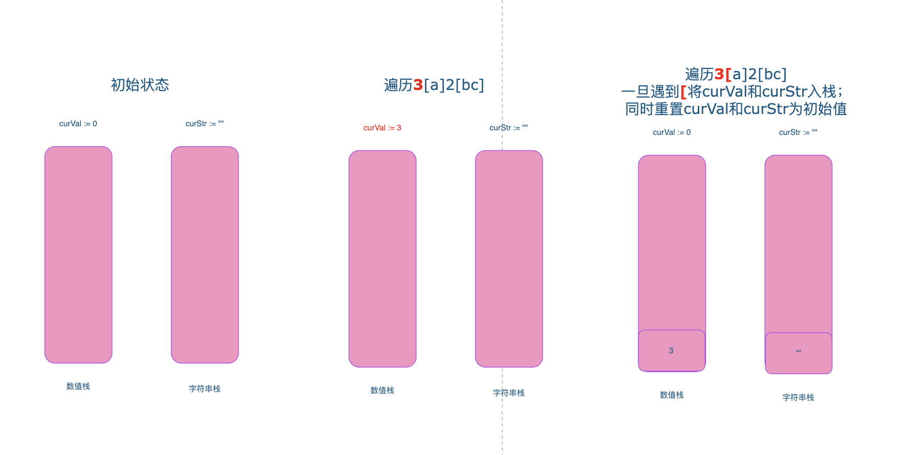
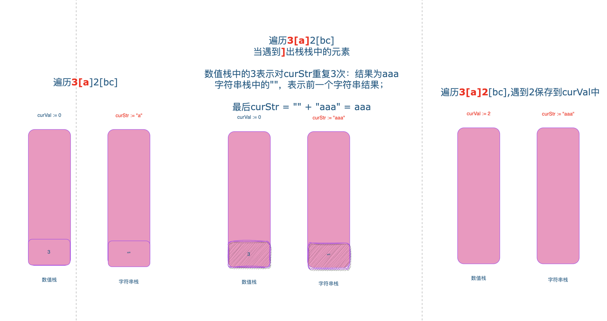
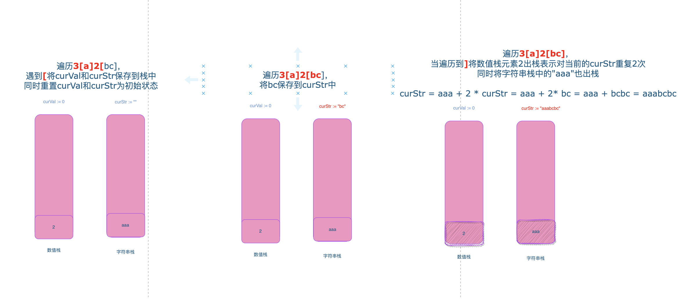

# 题目：字符串解码



# 思路

按照题目编码规格：要想解码`k[encoded_string]` 需要将方括号外面的`k`记录下来，同时将方括号里面的`encoded_string`记录下来，然后进行解码。

再例如`2[a3[b]]`这种嵌套的模式，我们需要先解码内部的`3[b]`为`bbb`，也就是变成`2[abbb]`,2才能被用来解码。所以一开始记录下来的2需要临时保存起来，等到内部先解码完成，才能解码外部。所以我们可以利用栈，按照先入栈2，再入栈3，出栈的时候先出栈3解码，再出栈2解码，正好符合嵌套的解码顺序。

这里还存在一个问题，什么时候入栈，什么时候出栈？**遇到`[`的入栈，遇到`]`的出栈**。遇到`[`说明方括号内部字符串的开始，遇到`]`说明方括号内的字符串的结束，可以开始解码了。

这里以`3[a]2[bc]`演示整个的入栈和出栈的逻辑。

遇到`[`入栈，栈中的元素3表示将要开始的方括号内的字符串重复的次数；栈中的`""` 表示`[` 之前的字符串（`[`外部历史字符串） ，`curStr`用来记录`[`内部的字符串



遇到`]`表示内部的字符串已经遍历完了，开始解码，数值栈中保存的3就是方括号内字符串重复的次数，字符串栈中保存的就历史的字符串，解码后的结果就是作为当前的curStr 



后序的逻辑相同，可以自己试着推到



# 完整代码

```go
func decodeString(s string) string {
    //  a6[c] 
    //从左到右遍历字符串， curStr和curNum 记录当前的数值
    //1. 遇到[ 入栈【当前的数值num和当前的str】，同时清空当前 num和 str，目的是为了复用str和num用于 [ ] 之间的元素
    //2. 比如，此时遍历到c那么 curStr = c curNum = 0
    //3. 遇到] 出栈 ，出栈的a就是前一个字符串 + 出栈的num值和当前的str组合 = 形成新的字符串，也就是展开了 a6[c] 为 acccccc

    curStr,strStack := "",[]string{} // curStr 方括号内的字符串
    curNum,numStack := 0,[]int{} // curNum 当前的数值

    for _,v := range s {
        if v >= '0' && v <= '9' { // 当前的curNum
            curNum = curNum * 10 + int(v-'0')
        } else if v == '[' { // 入栈，记录下当前的curNum和curStr
            strStack = append(strStack,curStr)
            numStack = append(numStack,curNum)
          	// 重置
            curStr = ""
            curNum = 0

        } else if v == ']' { //出栈，上次记录下来的curNum和curStr,目的是为了展开[]之间的字符串

            preStr := strStack[len(strStack)-1] // 方括号之前的历史字符串
            preNum := numStack[len(numStack)-1] // 本方括号内的字符串重复的次数

            // 这里对curStr进行重复preNum次，例如：a2[c] 等价于编码成 acc
            curStr = preStr + strings.Repeat(curStr,preNum) 
          	// 出栈
            strStack = strStack[:len(strStack)-1]
            numStack = numStack[:len(numStack)-1]

        }else { // 当前的curStr
            curStr += string(v)
        }
    }
    return curStr
}
```

