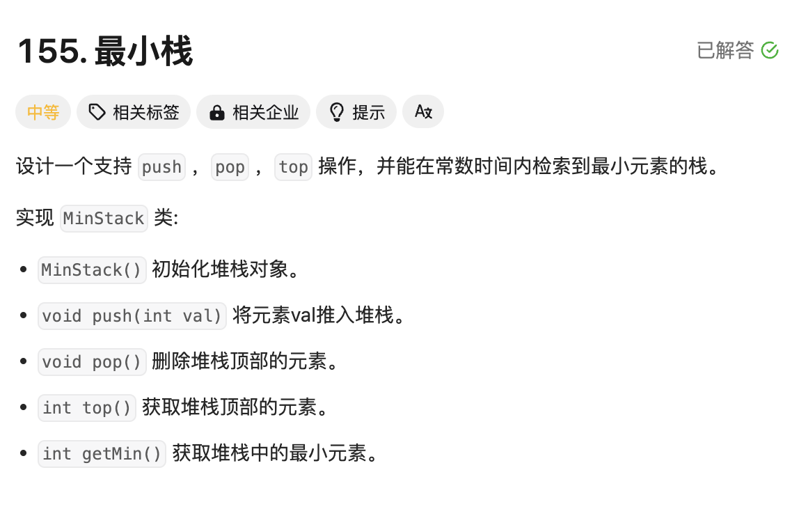
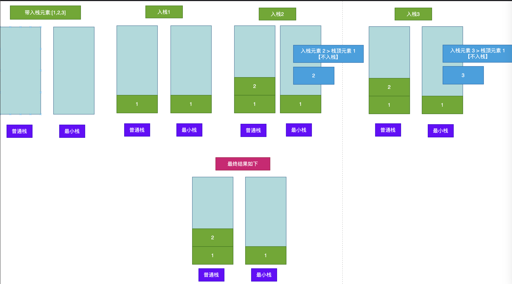

# 题目



# 思路

定义两个栈变量：

- 普通栈保存所有元素
- 最小栈：入栈元素 必须【小于or等于】栈顶元素，否则不能入栈



# 完整代码

```go
type MinStack struct {
    stack []int // 普通栈
    minstack []int // 最小栈
}


func Constructor() MinStack {
  	// 初始化
    return MinStack {
        stack:make([]int,0),
        minstack:make([]int,0),
    }
}


func (this *MinStack) Push(val int)  {
  	// 普通栈直接入栈
    this.stack = append(this.stack,val)
    if len(this.minstack) == 0 {
        this.minstack = append(this.minstack,val)
    } else {
      	// 最小栈：入栈元素 >= 栈顶元素 才能入栈
        if this.minstack[len(this.minstack)-1] >= val {
            this.minstack = append(this.minstack,val)
        }
    }
}


func (this *MinStack) Pop()  {
  	// 如果被删除的元素【等于】最小栈的栈顶元素，最小栈也要删除
    if this.Top() == this.minstack[len(this.minstack)-1] {
         this.minstack = this.minstack[:len(this.minstack)-1]
    }
  	// 普通栈直接删除
    this.stack = this.stack[:len(this.stack)-1]
}

// 普通栈栈顶元素
func (this *MinStack) Top() int {
    return this.stack[len(this.stack)-1]
}

// 最小栈栈顶元素
func (this *MinStack) GetMin() int {
    return this.minstack[len(this.minstack)-1]
}
```


