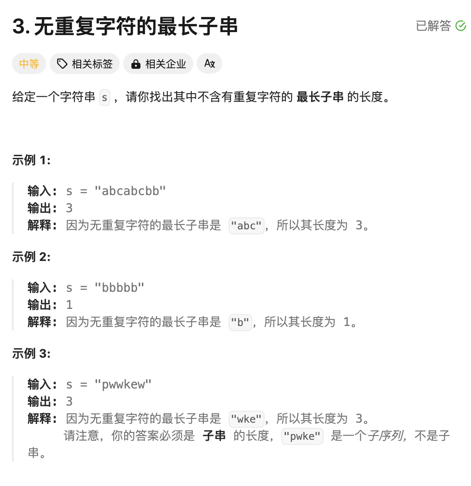
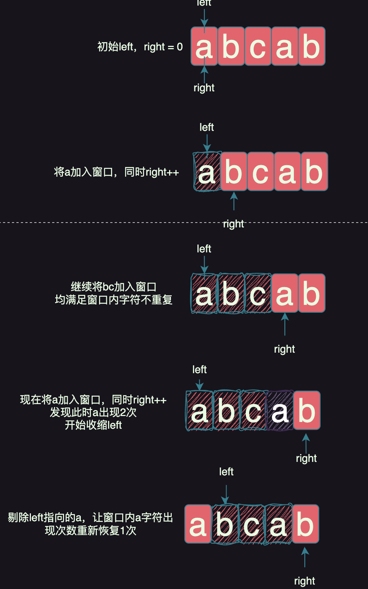

# 题目：[3. 无重复字符的最长子串](https://leetcode.cn/problems/longest-substring-without-repeating-characters/)



# 思路

这题也是求最值问题，但是本题需要使用滑动窗口解决。

```
滑动窗口代码套路：
1.定义left和right两个左右指针，初始值都是0
2.right不断的右移一个元素，记录下当前窗口[left,right]内的结果是否符合预期
3.当结果不符合，开始不断右移left，让窗口[left,right]重新符合期望结果
```

伪代码如下:

```go
定义left = 0 right = 0

定义窗口变量win记保存结果

for 在right不越界的前提下 {
    将right加入到win中
    右移right++
	
	
    for win不满足条件 {
        将left从win中剔除
        右移left++（知道win重新满足条件for循环结束，right继续重新右移）
      }
}
```


本题的核心思路在于看left和right之间的字符是否重复出现：



# 完整代码

```go
func lengthOfLongestSubstring(s string) int {
    //滑动窗口【左右边界】
    left,right := 0,0

    // 窗口中字符出现的次数
    win := make(map[byte]int)

    result := 0

    max := func (a ,b int) int {
        if a > b {
            return a
        }
        return b
    }
    for right < len(s) {

        ch := s[right] // 当前字符
        right++ // 移动右边界+1
        win[ch]++// 字符出现的次数+1

        for win[ch] > 1 { //当字符出现的次数多于1次，说明滑动窗口中存在重复字符，不符合题意；需要移动左边界，把重复字符删掉，保证滑动窗口的字符数量都是1个，满足题意
            d := s[left]
            left++
            win[d]--
        }

        // 执行到这里，说明窗口字符出现的次数，符合题意，记录一次结果

        result = max(result,right-left)
    }

    return result
}

```


