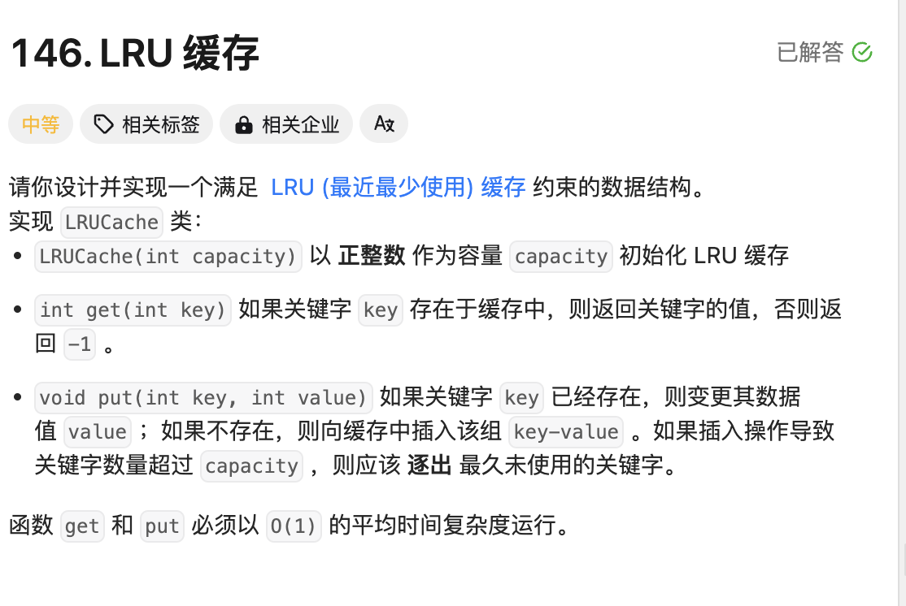
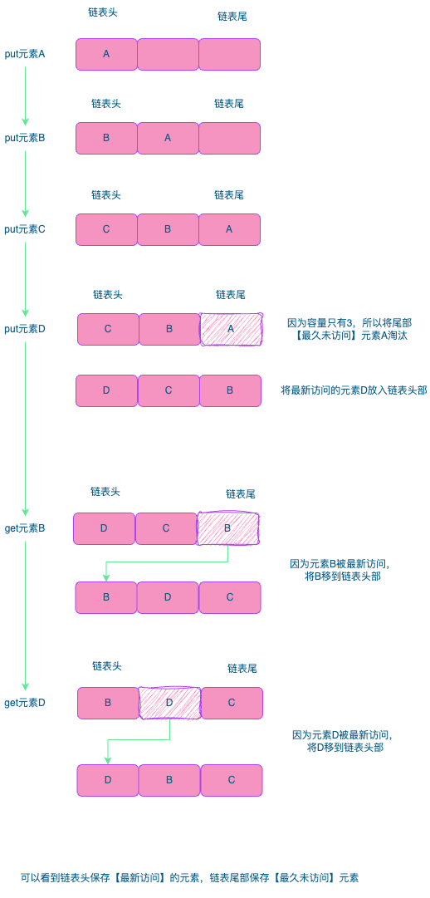

# 题目：LRU缓存



# 思路

LRU算法类似于体育老师上课点名字排成一排，被点到名字的同学站自动站到第一个位置，其他的同学顺序往后移一位。

1. Put：新数据插入到链表的头部；
2. Get：每当缓存命中数据，将数据移动到链表的头部；
3. 当链表满了，将链表尾部的数据丢弃；



本题目解题关键：

- 要求`put`和`get`方法的时间复杂度为 `O(1)`，那就要使用`Hash Table`
- 链表数据结构用来实现`LRU`算法的元素淘汰机制

# 完整代码

```go
type LRUCache struct {
    m map[int]*list.Element // hash table 保存链表中的节点
    l *list.List // l 链表数据结构
    cap int // 整个缓存的容量
}

// Data 用来保存节点值
type Data struct {
    Key int
    Value int
}


func Constructor(capacity int) LRUCache {
    cache := LRUCache{}
    cache.m = make(map[int]*list.Element,capacity)
    cache.l = list.New()
    cache.cap = capacity
    return cache
}


func (this *LRUCache) Get(key int) int {
    if v,ok := this.m[key];ok { // 实现O（1）复杂度的获取
        this.l.MoveToFront(v) // 如果元素存在，移到链表头部
        return v.Value.(Data).Value //返回节点中保存的值
    }
  	// 如果元素不存在，返回-1
    return -1
}


func (this *LRUCache) Put(key int, value int)  {
    if v,ok := this.m[key];!ok { // 节点元素不存在
      	// 判断容量是否已满
        if this.cap == this.l.Len() {
            data := this.l.Remove(this.l.Back())// 删除链表尾部的节点
            delete(this.m,data.(Data).Key) // 注意：同时map中的节点也要删除
        }
        // 将新的节点值，加入到链表头部 和 map中
        e := this.l.PushFront(Data{key,value})
        this.m[key] = e

    } else { // 节点元素存在
      	// 修改节点值
        v.Value = Data{key,value}
      	// 移动到链表头部
        this.l.MoveToFront(v)
    }
}

/**
 * Your LRUCache object will be instantiated and called as such:
 * obj := Constructor(capacity);
 * param_1 := obj.Get(key);
 * obj.Put(key,value);
 */
```


