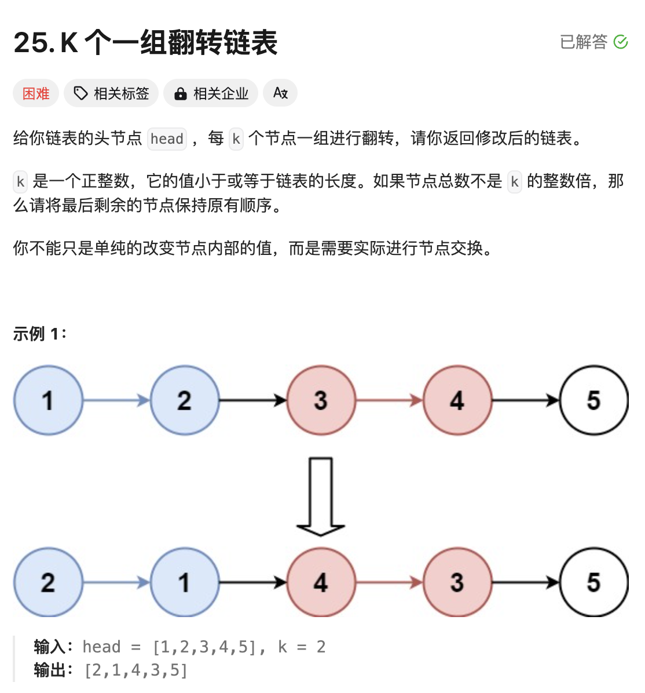
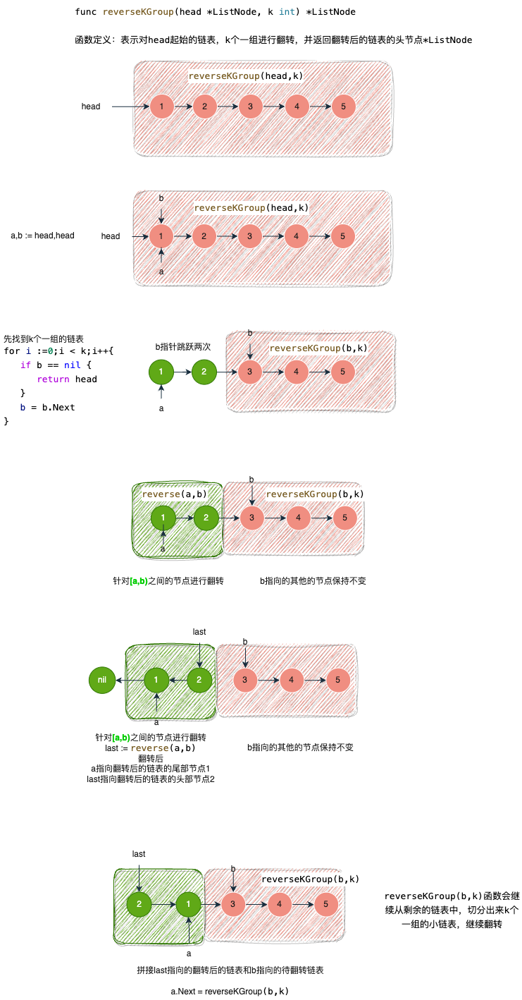

# 题目



# 思路

题目理解的核心：就像一块蛋糕，每次吃的时候，切割出来一小块，剩下的蛋糕不动，当我们吃完了这一小块，继续从剩下的蛋糕中再切割出来一块来吃

- K个一组翻转链表，那肯定要先找到这一组链表的【头节点】和【尾节点】，针对这一小段链表进行翻转。翻转成功以后，继续找下一小段链表进行翻转；当每一次的小段链表都完成了翻转，整个链表也就完成了翻转；
- 

# 完整代码

结合上图代码应该很容易看的懂

```go
/**
 * Definition for singly-linked list.
 * type ListNode struct {
 *     Val int
 *     Next *ListNode
 * }
 */
func reverseKGroup(head *ListNode, k int) *ListNode {
    a,b := head,head
    //截取一个链表
    for i :=0;i < k;i++{
        if b == nil {
            return head
        }
        b = b.Next
    }
    //翻转链表
    last := reverse(a,b)
    //链表的尾部，拼接剩余待翻转的链表
    a.Next = reverseKGroup(b,k)
    return last
}

//翻转链表(指定范围),返回头节点
func reverse(a,b *ListNode) *ListNode {
    var pre *ListNode = nil
    for a != b {
        temp := a
        a = a.Next
        temp.Next = pre
        pre = temp
    }
    return pre
}
```

