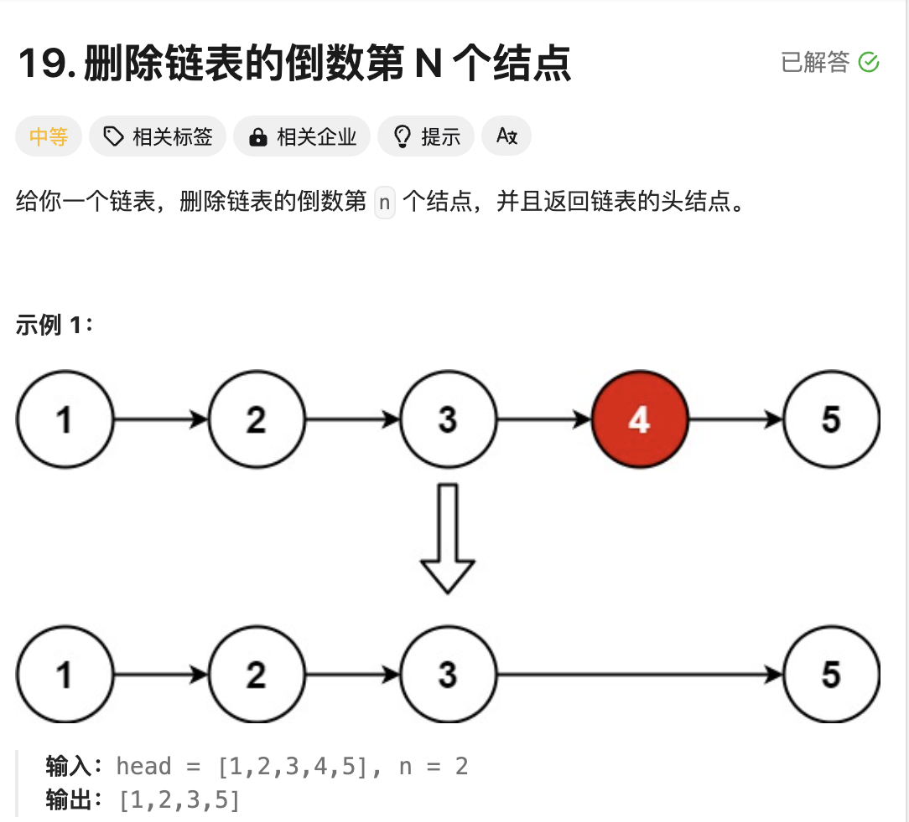
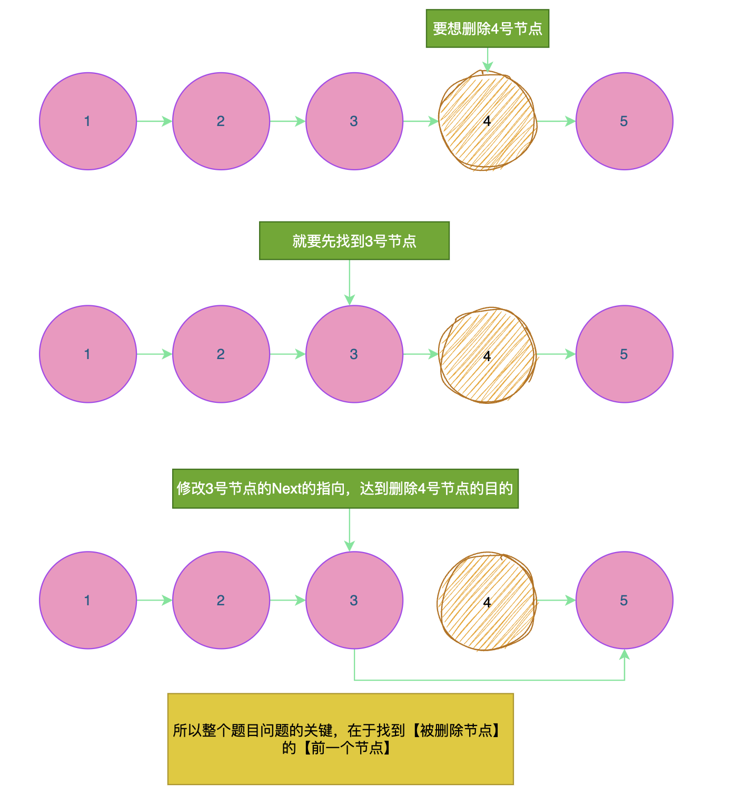
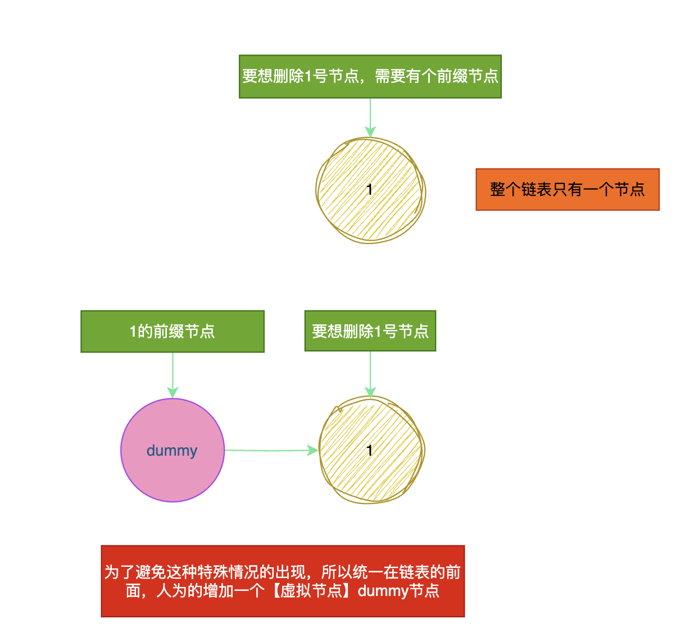
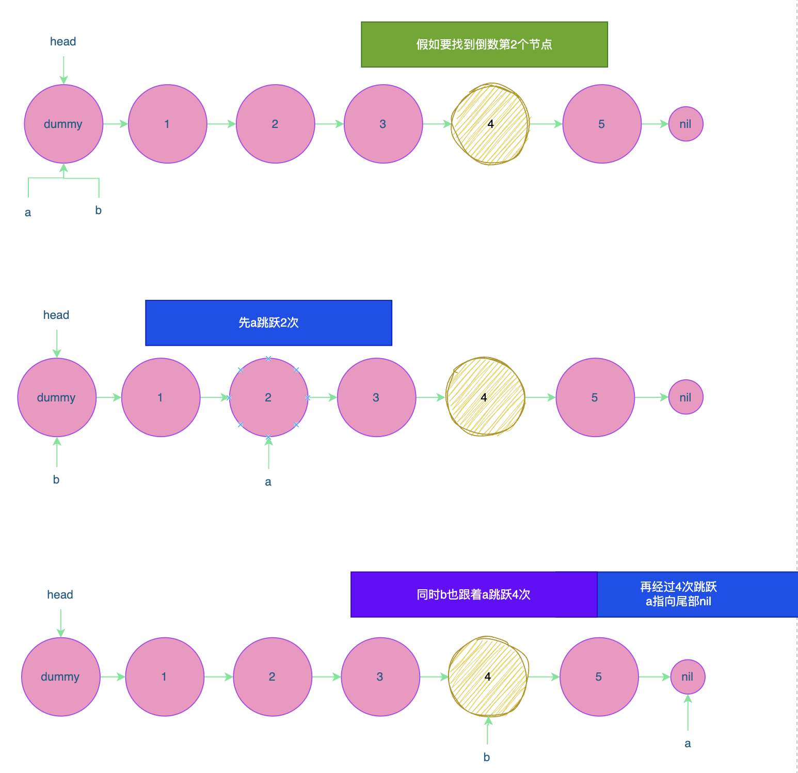

# 题目



# 思路



题目的问题就变为：**找到【倒数】的第N+1节点，利用`N+1`节点来删除`N`节点**。

这里还存在一个特殊的情况，如果整个链表**只有一个节点**，那就没有**倒数的N+1节点**。



# 完整代码

```go
/**
 * Definition for singly-linked list.
 * type ListNode struct {
 *     Val int
 *     Next *ListNode
 * }
 */
func removeNthFromEnd(head *ListNode, n int) *ListNode {
    //1.需要额外加一个虚拟节点
    dummy := &ListNode{Val:0}
    dummy.Next = head

    //2.找到第n+1个节点
    node := findN(dummy,n+1) 
    node.Next = node.Next.Next
    return dummy.Next
}


func findN(head *ListNode,n int) *ListNode {
  	// 假如整个链表需要跳跃m次
  	//1.先让a跳跃n次
    a,b := head,head
    for i := 0;i<n;i++{
        a = a.Next
    }
  	//2.a和b同时跳m-n次
    for a != nil {
        a = a.Next //a 到达尾部
        b = b.Next //b 指向的就是第n个节点
    }
    return b
}
```


`findN`函数图示：



