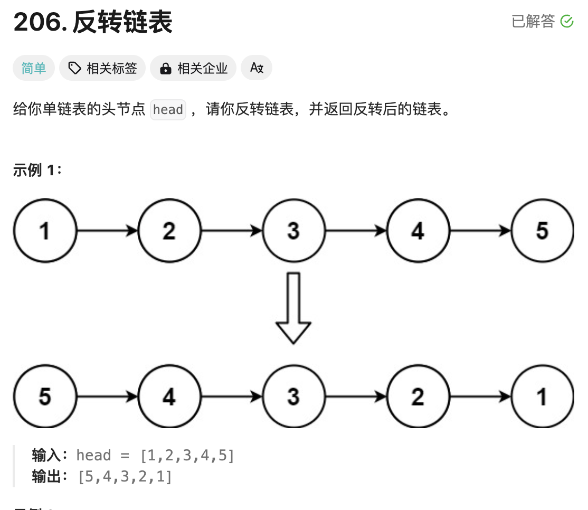
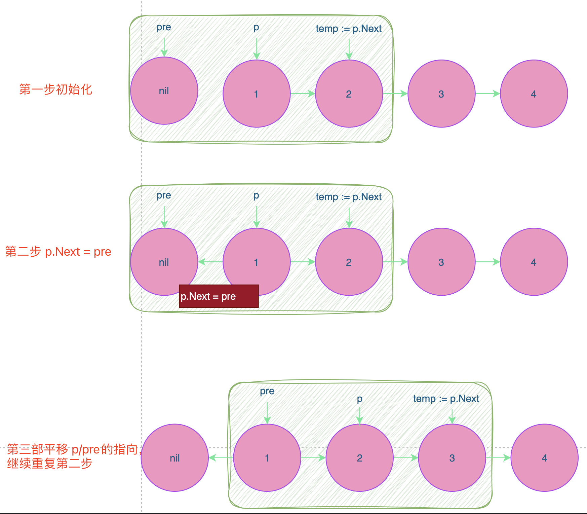

# 题目



# 思路

递归方式：

`last := reverseList(head.Next)` 表示对`head.Next`的链表进行反转，此时将`head.Next`链表看成一个整体节点；完整反转之后，对`head`和`head.Next`相邻对两个节点进行反转


```go
/**
 * Definition for singly-linked list.
 * type ListNode struct {
 *     Val int
 *     Next *ListNode
 * }
 */
func reverseList(head *ListNode) *ListNode {
    // 1.分治的思想，对整个链表反转，【相当于对 【节点1】 之后对整个链表反转后再拼接】
    if head == nil || head.Next == nil {
        return head
    }
    last := reverseList(head.Next) //先对head.Next的链表进行反转
    //然后在后序遍历的位置，拼接
    head.Next.Next = head
    head.Next = nil
    return last
}
```


实用迭代的方式：



```go
/**
 * Definition for singly-linked list.
 * type ListNode struct {
 *     Val int
 *     Next *ListNode
 * }
 */
func reverseList(head *ListNode) *ListNode {
    var pre *ListNode = nil
    p := head
    for p != nil {

        temp := p.Next // 临时保存p的后缀节点
        p.Next = pre //将p的后缀节点指向pre
        pre = p // p变成了的前缀节点
        p = temp //p指针后移一位
    }
    return pre
}
```

