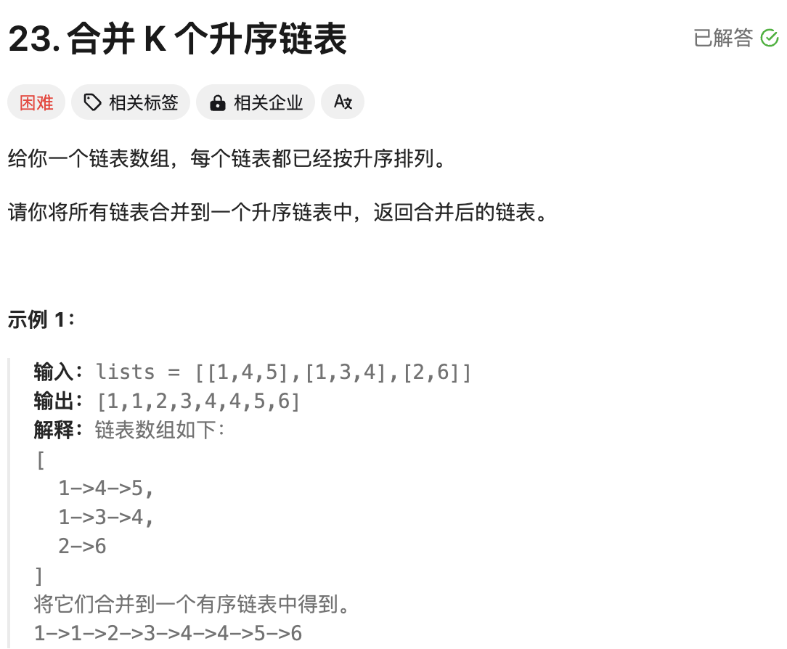
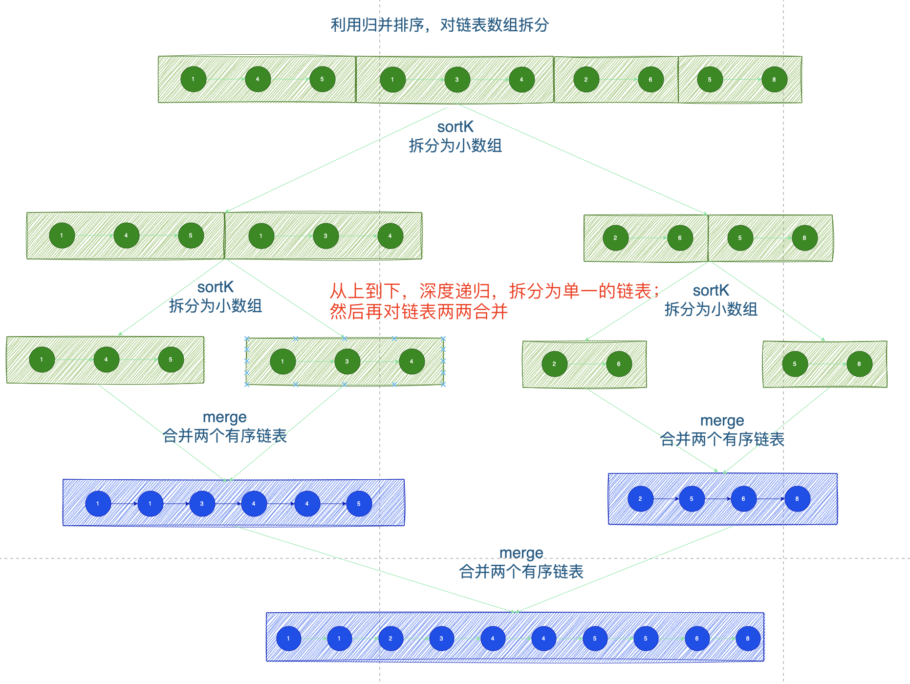

# 题目



# 思路

- 数组中的链表都是有序链表；对数组进行无限次拆分，变成更小的子数组（即每个数组中只包含一个链表）；然后对链表两个合并，变成一个更大的有序链表



# 完整代码

```go
/**
 * Definition for singly-linked list.
 * type ListNode struct {
 *     Val int
 *     Next *ListNode
 * }
 */


func mergeKLists(lists []*ListNode) *ListNode {
    return sortK(lists,0,len(lists)-1)
}

//定义：sortK 对【left，right】之间的链表排序，返回有序链表头节点
func sortK( lists []*ListNode,left,right int) *ListNode {
  	// 说明lists数组中只剩下一个链表
    if left == right {
        return lists[left]
    }
  	// 越界，无链表
    if left > right {
        return nil
    }

    mid := left +(right-left)/2
  	// 左边的子数组[left,mid],返回有序链表头节点
    l := sortK(lists,left,mid)
  	// 右边的子数组[mid+1,right],返回有序链表头节点
    r := sortK(lists,mid+1,right)
  	// 对有序的两个链表进行合并
    return merge(l,r)
}
//对两个有序链表合并，返回头节点
func merge(l,r *ListNode) *ListNode {
  	// 定义虚拟节点dummy
    dummy := &ListNode{Val:0,Next:nil} 
    p := dummy
  	// 将数组更小的节点，拼接到p后面
    for l != nil && r != nil {
        if l.Val < r.Val {
            p.Next = l
            l = l.Next
        } else {
            p.Next = r
            r = r.Next
        }
        p = p.Next
    }
    // l链表还有剩余节点
    if l != nil {
        p.Next = l
    }
  	// r链表还有剩余节点
    if r != nil {
        p.Next = r
    }
    return dummy.Next
}   
```

