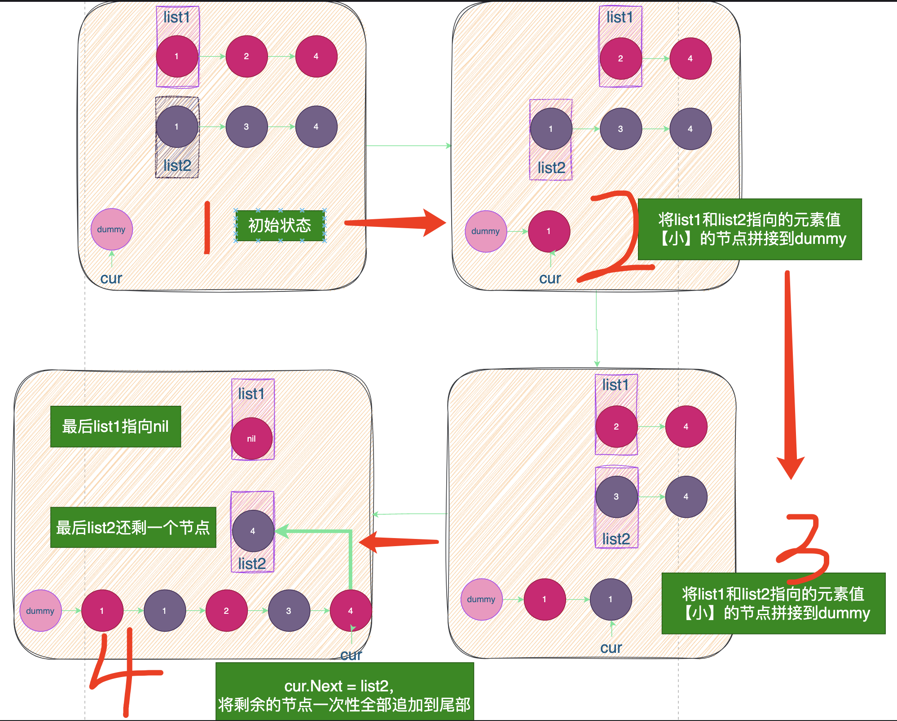

# 题目


# 思路

**建议直接看代码，看不懂再来看图解**

- 定义一个虚拟节点`dummy`用来保存拼接后的链表；
- 用两个指针`list1和list2`分别指向两个链表的头节点，将节点值较小的节点拼接到`dummy`节点后面（重复该过程），最后将剩余的链表拼接到尾部



# 完整代码

```go
/**
 * Definition for singly-linked list.
 * type ListNode struct {
 *     Val int
 *     Next *ListNode
 * }
 */
func mergeTwoLists(list1 *ListNode, list2 *ListNode) *ListNode {
  	// 1.定义虚拟节点dummy
    var dummy *ListNode = &ListNode{Val : 1000,Next:nil}
    var cur *ListNode//当前指针
    cur = dummy
  	// 2.将较小的元素值追加到cur尾部
    for list1 != nil && list2 != nil {
        if list1.Val <= list2.Val {
            cur.Next = list1
            cur = cur.Next
            list1 = list1.Next
        } else {
            cur.Next = list2
            cur = cur.Next
            list2 = list2.Next
        }
    }
  	// 3. list1还有剩余
    if list1 != nil {
        cur.Next = list1
    }
  	// 4. list2还有剩余
    if list2 != nil {
        cur.Next = list2
    }
  	// 5.dummy只是临时用的辅助节点，Next才是实际的链表头节点
    return dummy.Next
}
```

