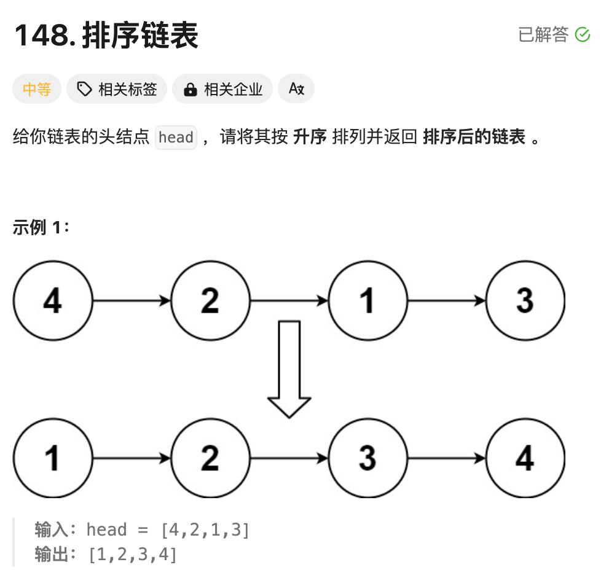
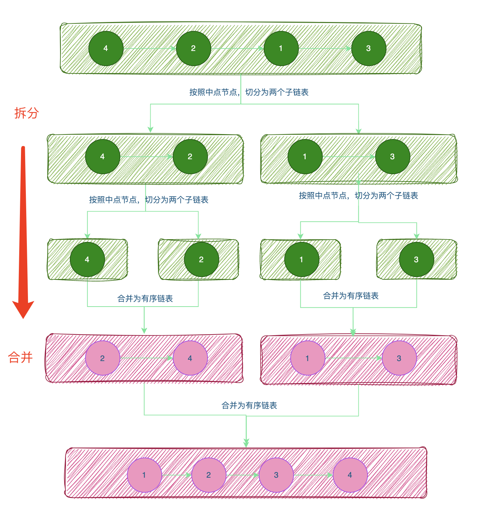

# 题目



# 思路



从上图也可以看出，先进行链表的切分过程（分治的思想），一直切一直切，直到切到每个链表只有一个节点（深度递归），开始进行链表的合并过程。

如何找到链表的中间节点？**采用快慢指针**

伪代码如下:

```go
fast,slow := head,head
for fast != nil && fast.Next != nil {
  fast = fast.Next.Next
  slow = slow.Next
}
```

以上图`4->2->1->3`为例：一开始fast和slow都指向节点4，fast一次跳跃两次，slow一次跳跃一次；最后slow指向节点1的位置，1即为第二段链表的起始节点；

但是还需要第一段链表【尾节点】和第二段链表【首节点】断开链接，形成两个子链表，所以还需要一个pre节点，用来指向slow的前置节点，请看下面的完整代码。

# 完整代码

```go

/**
 * Definition for singly-linked list.
 * type ListNode struct {
 *     Val int
 *     Next *ListNode
 * }
 */
 
 
func sortList(head *ListNode) *ListNode {
    //【空链表】或者【只有一个节点的链表】
    if head == nil || head.Next == nil {
        return head
    }
    fast,slow := head,head
    pre := head // ！！！这个很重要，存储中点的前置节点
    for fast != nil && fast.Next != nil { // 快慢指针找到中间节点
        fast = fast.Next.Next
        pre = slow  // 保存中间节点的【前置节点】
        slow = slow.Next
    }
    pre.Next = nil //！！！目的：找到中间节点的前一个节点，使【左右链表断开】
    
    l1 := sortList(head) //左链表
    l2 := sortList(slow) //右链表
    return merge(l1,l2)
}


func merge(l1,l2 *ListNode) *ListNode {
  	//1.创建一个虚拟节点dummy
    dummy := &ListNode{0,nil}
    cur := dummy
  	//2.合并两个升序链表，将较小的节点值拼接到cur后面
    for l1 != nil && l2 != nil {
        if l1.Val < l2.Val {
            cur.Next = l1
            l1 = l1.Next
        } else {
            cur.Next = l2
            l2 = l2.Next
        }
      	// cur后移一位
        cur = cur.Next
    }

    if l1 != nil {
        cur.Next = l1
    }

    if l2 != nil {
        cur.Next = l2
    }

    return dummy.Next
}

```

