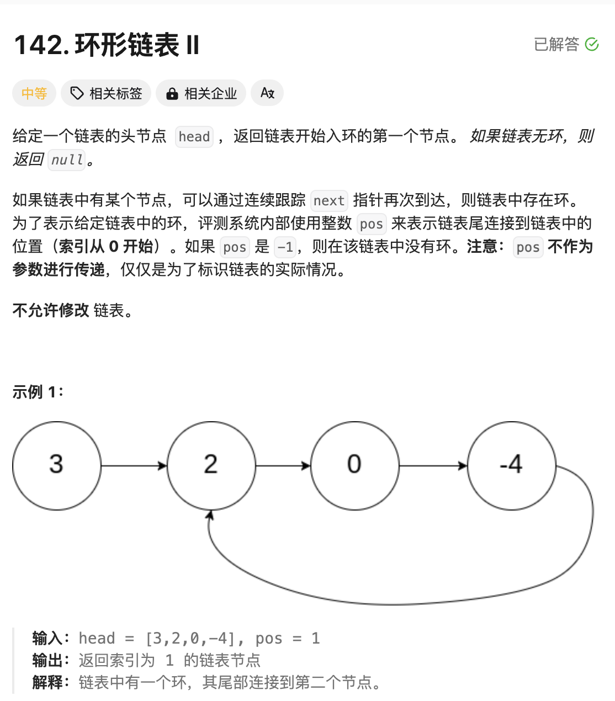
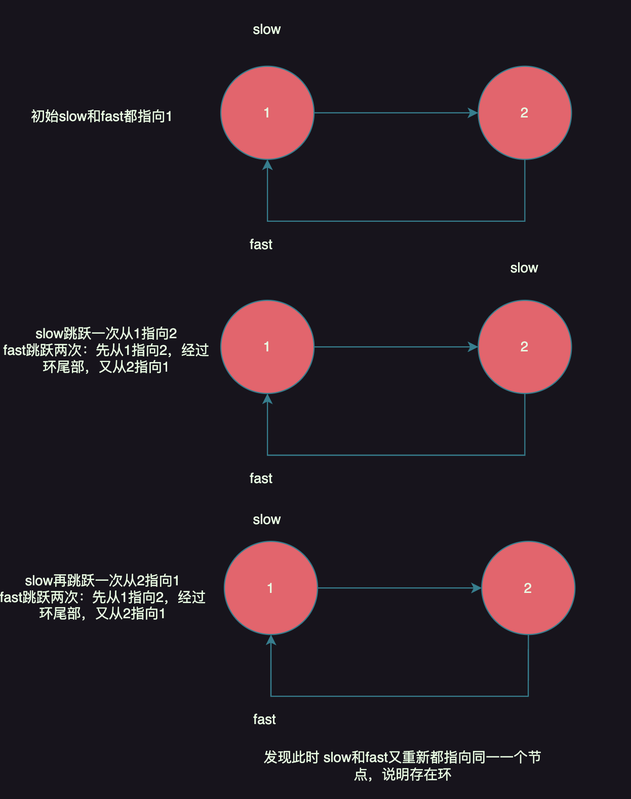
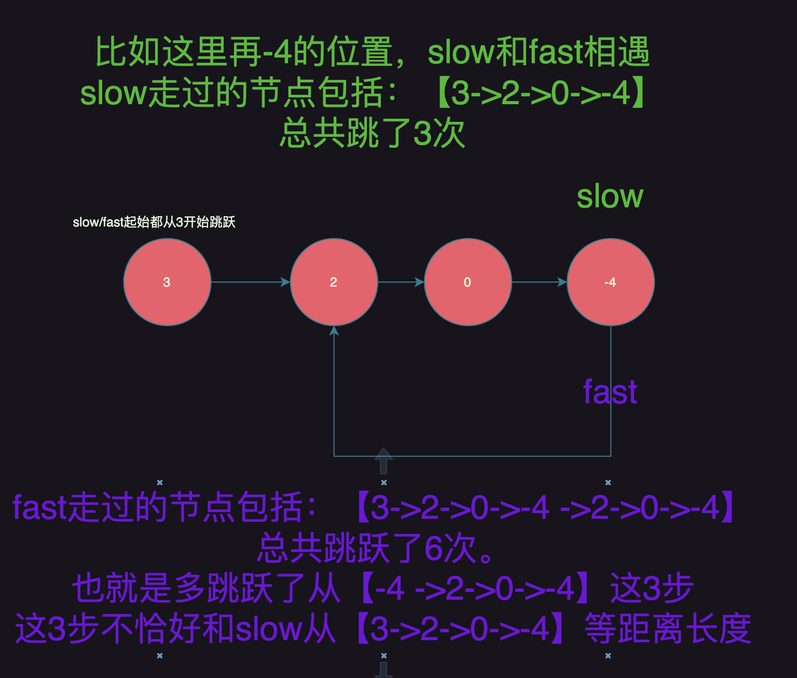

# 题目：环形链表II




# 思路

本题的其实在问两个问题：

1.是否存在环；

2.返回环的入口节点，也就是环点；以上图为例，就是2这个节点；


## 如何判断链表是否存在环？

解题套路如下：

```
1.定义slow和fast两个指针,都指向起始节点；
2.每次让slow跳跃一次，fast跳跃两次
3.如果在经过一段跳跃以后，slow == fast，说明存在环，反之不存在
```

伪代码如下：
```go
//2.判断是否有环
fast,slow := head,head
for fast != nil && fast.Next != nil {
  fast = fast.Next.Next
  slow = slow.Next
  if fast == slow { // 说明存在环
    break
  }
}
```




## 如何找到环的入口节点？

前置知识：slow每次跳跃1次，fast每次跳跃2次，那么fast运动的距离一定是slow运动距离的2倍；也可以理解你和小红一起走路，她每秒走2米，你每秒走1米，所以她走的距离肯定就是你行走距离的2倍了。



将slow重置回起始节点3的位置，fast位置保存指向-4的位置不变；然后slow和fast各自都跳跃一步，找到的节点就是题目要求的环的交点。


# 完整代码

```go
/**
 * Definition for singly-linked list.
 * type ListNode struct {
 *     Val int
 *     Next *ListNode
 * }
 */
func detectCycle(head *ListNode) *ListNode {
    //1.空链表
    if head == nil {
        return head
    }
    
    //2.判断是否有环
    fast,slow := head,head
    for fast != nil && fast.Next != nil {
        
        fast = fast.Next.Next
        slow = slow.Next
        if fast == slow {
            break
        }
    }
    //3.说明没有环,跳出上面for循环有两种情况，break或者for的循环条件不满足
    if fast == nil || fast.Next == nil {
        return nil
    }

    //4.说明有环，需要找到环的起始位置
    slow = head // slow重置回起始节点，fast保存指向的节点不变
    for slow != fast {// 如果fast和slow相同，说明找到环的交点
        fast = fast.Next
        slow = slow.Next
    }

    return slow

}
```

